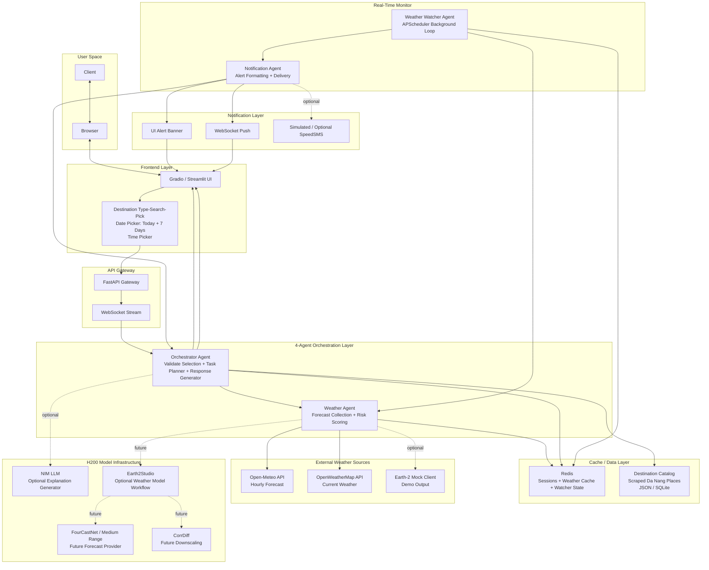
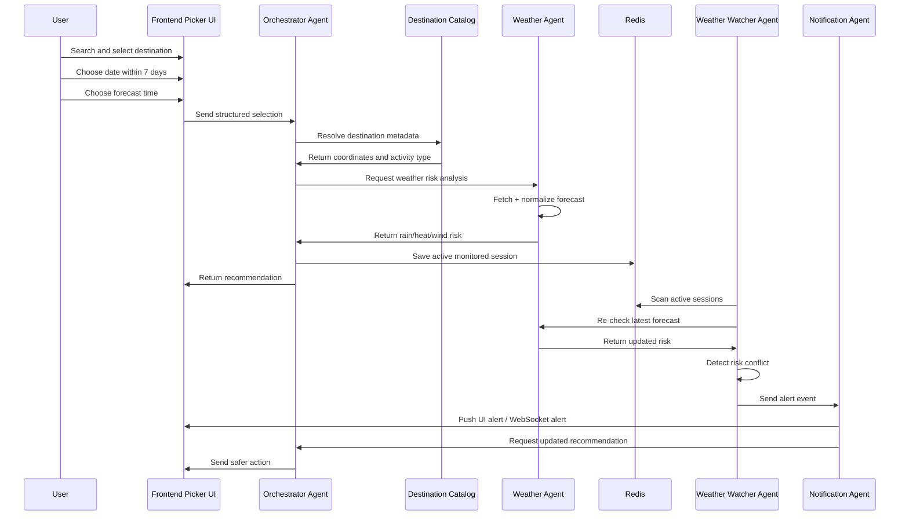

# Weatherise MVP Implementation Guide
## 4-Agent Da Nang Tourism Weather-Risk System

> **Project focus:** Vietnam tourism weather-risk intelligence  
> **MVP demo region:** Da Nang, Vietnam  
> **Core architecture:** 4-agent Multi-Agent System  
> **Agents:** Orchestrator Agent, Weather Agent, Weather Watcher Agent, Notification Agent  
> **Infrastructure:** NVIDIA H200 hackathon cluster  
> **Planning model:** Must Have / Should Have / Nice to Have  
> **Updated input rule:** Users do **not** rely on free natural language for the MVP. Users select a destination from a searchable destination list, then choose forecast date/time within a 7-day range.

---

# Navigation

- [1. MVP Direction](#1-mvp-direction)
- [2. Updated Input Process](#2-updated-input-process)
- [3. What We Are Building](#3-what-we-are-building)
- [4. What We Are Not Building in the MVP](#4-what-we-are-not-building-in-the-mvp)
- [5. Current Infrastructure](#5-current-infrastructure)
- [6. Recommended Tech Stack](#6-recommended-tech-stack)
- [7. Final MVP System Architecture](#7-final-mvp-system-architecture)
- [8. 4-Agent System Design](#8-4-agent-system-design)
- [9. Earth-2 / Earth2Studio Usage](#9-earth-2--earth2studio-usage)
- [10. H200 Cluster Model Usage](#10-h200-cluster-model-usage)
- [11. Data Sources and Destination Catalog](#11-data-sources-and-destination-catalog)
- [12. Weatherise Standard Weather Schema](#12-weatherise-standard-weather-schema)
- [13. Tourism Risk Scoring Rules](#13-tourism-risk-scoring-rules)
- [14. API Design](#14-api-design)
- [15. Folder Structure](#15-folder-structure)
- [16. Priority-Based Implementation Plan](#16-priority-based-implementation-plan)
- [17. Demo Flow](#17-demo-flow)
- [18. Risk and Fallback Strategy](#18-risk-and-fallback-strategy)
- [19. Final Technical Recommendation](#19-final-technical-recommendation)

---

# 1. MVP Direction

Weatherise is a Vietnam-focused weather intelligence platform. For the MVP, the project is narrowed down to a **Da Nang tourism weather-risk decision system**.

The MVP does not need to become a complete travel planner. It should prove the most important concept:

```txt
Destination selected by user
→ Forecast date/time selected by user
→ Weather forecast
→ Da Nang tourism weather-risk analysis
→ Activity impact
→ Real-time alert
→ Safer recommendation
```

The system should answer practical tourism questions such as:

```txt
Is Son Tra Peninsula safe at 6 PM tomorrow?
Is My Khe Beach suitable this afternoon?
Is Marble Mountains risky during this weather window?
Should outdoor food street activities be delayed because of rain?
Can Weatherise notify me if the weather becomes unsafe?
```

The MVP uses only four agents:

```txt
1. Orchestrator Agent
2. Weather Agent
3. Weather Watcher Agent
4. Notification Agent
```

---

# 2. Updated Input Process

## 2.1 Feedback Change

The MVP input should be changed from **natural-language prompt input** to **choose-option block input**.

Old input approach:

```txt
User types a natural language request.
Example: "I want to visit Son Tra Peninsula at 6 PM tomorrow."
```

New input approach:

```txt
User chooses destination from a searchable list.
User chooses forecast date.
User chooses forecast time.
User chooses monitoring/alert option.
System returns weather-risk decision.
```

This makes the MVP more reliable because the system no longer depends on NLP parsing to identify location, time, or destination.

---

## 2.2 Frontend Input Blocks

The frontend should provide controlled input blocks.

| Input block | UI type | Source | Rule |
|---|---|---|---|
| Destination | Searchable dropdown / type-search-pick | Destination catalog after scraping | User must select one valid destination |
| Activity category | Auto-filled from destination metadata | Destination catalog | Example: beach, mountain, outdoor, indoor |
| Forecast date | Date picker | UI controlled | User can select today to 7 days from today |
| Forecast time | Time picker / time slot selector | UI controlled | User selects target forecast time |
| Monitoring | Toggle / checkbox | UI state | User chooses whether Weatherise should monitor changes |
| Alert channel | Dropdown | UI options | UI banner, WebSocket, simulated SMS |

The most important UI element is the destination selector.

The selector should work as:

```txt
Type → search → filter destination list → pick destination
```

Example:

```txt
User types: "son"
UI shows: Son Tra Peninsula
User picks: Son Tra Peninsula
Backend receives: destination_id = danang_son_tra_peninsula
```

---

## 2.3 Destination Catalog Flow

Weatherise should use a destination catalog built from scraped/curated Da Nang tourism data.

Flow:

```txt
Scrape / collect destinations
→ Clean destination data
→ Normalize destination fields
→ Store in destination catalog
→ Frontend loads/searches catalog
→ User selects destination
→ Backend resolves coordinates and metadata
→ Weather Agent checks forecast for that destination
```

For the MVP, the destination catalog can be a JSON file first. SQLite can be added later if search/filtering becomes more complex.

Recommended first catalog file:

```txt
backend/data/danang_locations.json
```

Example destination record:

```json
{
  "destination_id": "danang_son_tra_peninsula",
  "name": "Son Tra Peninsula",
  "city": "Da Nang",
  "country": "Vietnam",
  "lat": 16.118,
  "lon": 108.273,
  "activity_type": "outdoor_nature",
  "tags": ["nature", "mountain", "viewpoint", "outdoor"],
  "bad_conditions": ["heavy_rain", "strong_wind", "low_visibility"],
  "safe_alternatives": ["Cham Museum", "Han Market", "indoor cafe"]
}
```

---

## 2.4 Forecast Time Limit

The forecast date must be limited to a maximum of **7 days from the current day**.

Rule:

```txt
Allowed forecast date = today to today + 7 days
```

Reason:

- It matches realistic short-range tourism planning.
- It keeps the MVP simple.
- It avoids long-range local prediction claims.
- It fits common public weather API usage.

Backend validation is required even if the frontend already limits the date picker.

If user selects a date outside the allowed range, return:

```json
{
  "error": "Forecast date must be within 7 days from today."
}
```

---

## 2.5 Updated Input Payload

The backend receives structured input, not a free-text prompt.

```json
{
  "destination_id": "danang_son_tra_peninsula",
  "forecast_date": "2026-06-08",
  "forecast_time": "18:00",
  "monitoring_enabled": true,
  "alert_channel": "ui_banner"
}
```

The backend resolves this into:

```json
{
  "destination_id": "danang_son_tra_peninsula",
  "name": "Son Tra Peninsula",
  "city": "Da Nang",
  "lat": 16.118,
  "lon": 108.273,
  "activity_type": "outdoor_nature",
  "forecast_datetime": "2026-06-08T18:00:00+07:00",
  "monitoring_enabled": true,
  "alert_channel": "ui_banner"
}
```

---

# 3. What We Are Building

The MVP builds a working system that can:

1. Load a Da Nang destination catalog.
2. Stream/search destinations in the frontend.
3. Let users select a destination by type-search-pick.
4. Let users choose a forecast date within 7 days.
5. Let users choose a forecast time.
6. Fetch weather data for the selected destination.
7. Normalize weather data into a Weatherise schema.
8. Score rain, heat, wind, and outdoor suitability.
9. Explain how the weather affects the selected destination.
10. Save active monitored sessions into Redis.
11. Monitor active plans in the background.
12. Detect weather conflicts.
13. Send UI alerts or WebSocket alerts.
14. Suggest a safer action when weather risk increases.

Example user interaction:

```txt
Destination: Son Tra Peninsula
Date: Tomorrow
Time: 18:00
Monitoring: Enabled
```

Example output:

```txt
Rain risk near Son Tra Peninsula at 18:00 is high.
Outdoor activity is not recommended.
Suggested action: move the visit earlier or switch to an indoor activity.
```

---

# 4. What We Are Not Building in the MVP

| Removed / postponed | New MVP handling |
|---|---|
| Free natural-language input | Use destination picker + date/time picker |
| Attraction Agent | Use destination catalog metadata |
| Route Agent | No full route optimization in MVP |
| Local Expert Agent | Use rule-based suggestions from destination metadata |
| Safety Agent | Add basic validation inside Orchestrator |
| Full RAG pipeline | Future upgrade |
| Milvus / vector search | Future upgrade |
| cuOpt route optimization | Future upgrade |
| Full Earth-2 production integration | Optional experiment or mock client |
| Full mobile app | Use Gradio / Streamlit first |
| Real SMS dependency | Use UI banner and WebSocket first |

The MVP should not spend most development time on RAG, routing, free-text NLP, or full Earth-2 deployment unless the core 4-agent flow already works.

---

# 5. Current Infrastructure

| Resource | Available |
|---|---|
| Cluster | NVIDIA Open Hackathon H200 server |
| GPU | 8× NVIDIA H200 |
| VRAM | About 141 GB per GPU |
| Total GPU memory | Around 1.1 TB VRAM |
| CPU | About 192 CPU cores |
| RAM | About 2 TB system RAM |
| Storage | About 28 TB NVMe |
| Storage mount | `/raid` |
| Team folder | `/raid/team` |
| JupyterLab workspace | `/workspace`, mapped to `/raid/team` |
| Access | SSH host + JupyterLab |
| Runtime | Docker with NVIDIA GPU runtime |
| NGC / NIM | NGC key available; NIM requires `NGC_API_KEY` during runtime |

Correct usage:

| Task | Correct environment |
|---|---|
| Run Docker / NIM / Redis / backend services | SSH host |
| Write code and notebooks | VS Code Remote SSH or JupyterLab |
| Store project source code | `/raid/team/Weatherise` |
| Store NIM/model cache | `/raid/nim-cache` |
| Store weather outputs | `/raid/team/Weatherise/data/weather` |
| Store logs | `/raid/team/Weatherise/logs` |

Important rule:

```txt
Docker and NIM should run on the host, not inside the JupyterLab container.
```

---

# 6. Recommended Tech Stack

## 6.1 Must-Have MVP Stack

| Layer | Tool | Reason |
|---|---|---|
| Frontend | Gradio or Streamlit | Fastest demo UI |
| Input UI | Searchable dropdown, date picker, time picker | Controlled input, fewer NLP errors |
| Backend | FastAPI | Clean API gateway |
| Agent orchestration | Python functions first, LangGraph optional | Avoid overengineering early |
| Destination catalog | JSON first, SQLite optional | Stores Da Nang destinations |
| Weather source | Open-Meteo | Free, no API key, stable for MVP |
| Weather fallback | OpenWeatherMap | Backup source for current conditions |
| Risk logic | Rule-based scoring | Fast, explainable, reliable |
| Session/cache | Redis | Active sessions and weather cache |
| Background jobs | APScheduler | Weather Watcher loop |
| Alert UI | UI alert banner | Must-have visible notification |
| Real-time update | WebSocket | Should-have live alert |
| Deployment | H200 host exposed port | Easy for mentor demo |

## 6.2 Optional NVIDIA/H200 Stack

| Layer | Tool | Reason |
|---|---|---|
| LLM response polishing | NIM LLM | Better natural-language explanation after structured input |
| Earth-2-ready path | Earth-2 mock client | Shows future integration without blocking MVP |
| Earth2Studio experiment | Earth2Studio notebook/script | Shows advanced weather model workflow |
| Forecast model | FourCastNet / FourCastNet NIM | Future medium-range model provider |
| Downscaling | CorrDiff | Future high-resolution local weather risk |
| Model comparison | Earth-2 MIP | Future academic/research validation |

## 6.3 Removed from MVP Stack

| Removed tool | Why |
|---|---|
| Natural-language intent parser as core feature | Controlled UI input is more reliable |
| Milvus | No RAG agent in MVP |
| NV-Embed | No vector retrieval in MVP |
| NV-Rerank | No RAG ranking in MVP |
| cuOpt | No route optimization agent in MVP |
| PostgreSQL | Redis + JSON / SQLite is enough for MVP |
| Google Places live API | Use pre-scraped destination catalog first |

---

# 7. Final MVP System Architecture

Main system flow:

```txt
User
→ Destination picker + date/time picker
→ Frontend
→ FastAPI Gateway
→ Orchestrator Agent
→ Destination Catalog
→ Weather Agent
→ Weather APIs / Earth-2 optional
→ Weatherise Risk Schema
→ Recommendation
→ Redis Session Store
→ Weather Watcher Agent
→ Notification Agent
→ UI Alert / WebSocket Push
```

## 7.1 Mermaid Architecture Diagram



## 7.2 Agent Sequence Diagram



---

# 8. 4-Agent System Design

## 8.1 Orchestrator Agent

The Orchestrator Agent controls the workflow.

Responsibilities:

- Receive structured selection from frontend.
- Validate selected destination.
- Validate forecast date is within 7 days.
- Resolve destination metadata from destination catalog.
- Decide whether monitoring should be enabled.
- Call Weather Agent for risk analysis.
- Convert weather risk into tourism recommendation.
- Save active session to Redis.
- Receive re-plan request from Notification Agent.
- Generate updated recommendation.

Implementation note:

```txt
Do not make NLP intent parsing a core MVP dependency.
Use structured input validation.
Use NIM LLM only for optional explanation polishing.
```

## 8.2 Weather Agent

The Weather Agent is the core weather intelligence component.

Responsibilities:

- Receive resolved destination coordinates and forecast time.
- Query Open-Meteo.
- Query OpenWeatherMap if key is available.
- Optionally query Earth-2 mock client.
- Normalize all weather outputs.
- Convert weather outputs into Weatherise schema.
- Score rain, heat, wind, and outdoor suitability.
- Return tourism-specific impact.

## 8.3 Weather Watcher Agent

The Weather Watcher Agent monitors active plans.

Responsibilities:

- Run in background.
- Load active sessions from Redis.
- Re-check forecast for selected destination and time.
- Compare previous risk and current risk.
- Detect conflict.
- Send conflict event to Notification Agent.

## 8.4 Notification Agent

The Notification Agent turns risk conflict into a user-facing alert.

Responsibilities:

- Receive conflict from Weather Watcher.
- Format alert message.
- Push alert to UI banner.
- Push WebSocket alert if implemented.
- Show simulated SMS if enabled.
- Request Orchestrator for safer recommendation.

---

# 9. Earth-2 / Earth2Studio Usage

Earth-2 should support the Weather Agent only. It should not directly connect to the frontend or Notification Agent.

| Resource | What it does | How Weatherise uses it | MVP status |
|---|---|---|---|
| Earth2Studio | Python toolkit for AI weather workflows | Optional Weather Agent experiment | Should have if time |
| Earth2Studio Data | Data access and preparation layer | Fetch / process weather data | Should have if time |
| Earth-2 Weather Analytics Blueprint | Reference architecture for weather analytics | Use as system design reference | Documentation / future |
| FourCastNet | AI forecast model | Future medium-range forecast provider | Nice to have |
| FourCastNet NIM | Deployable forecast model API | Future H200 weather model service | Nice to have |
| CorrDiff | Downscaling weather data | Future high-resolution Da Nang risk map | Future |
| Earth-2 Nowcasting | Short-term weather monitoring | Future upgrade for Weather Watcher | Future |
| Earth-2 Medium Range | Multi-day forecast | Future tourism planning support | Future |
| Earth-2 MIP | Model intercomparison / evaluation | Future academic validation | Future |

Correct Earth-2 integration layers:

```txt
Layer 1: Earth-2 Mock Client
Layer 2: Earth2Studio Data Experiment
Layer 3: FourCastNet / FourCastNet NIM
Layer 4: CorrDiff downscaling
Layer 5: Nowcasting / Medium Range / MIP
```

---

# 10. H200 Cluster Model Usage

Because the MVP has only 4 agents, we should not overload the cluster with unnecessary services.

| GPU | Usage | Status |
|---|---|---|
| GPU 0–1 | NIM LLM for optional response generation | Optional |
| GPU 2–3 | Earth2Studio / Earth-2 experiments | Optional |
| GPU 4 | Reserve | No RAG needed |
| GPU 5 | Reserve | No reranker needed |
| GPU 6 | Reserve | No cuOpt needed |
| GPU 7 | Backup / testing | Reserve |

Minimum required services:

```txt
Redis
FastAPI backend
Gradio / Streamlit frontend
Destination catalog
Weather Agent
Weather Watcher Agent
Notification Agent
```

Optional services:

```txt
NIM LLM
Earth-2 mock endpoint
Earth2Studio notebook
WebSocket
SpeedSMS
```

---

# 11. Data Sources and Destination Catalog

## 11.1 Weather Data Sources

| Source | Use | Priority |
|---|---|---|
| Open-Meteo | Hourly forecast, no key needed | Must have |
| OpenWeatherMap | Current weather / fallback | Should have |
| Earth-2 Mock | Demo architecture | Should have |
| Earth2Studio | Advanced research workflow | Nice to have |
| FourCastNet / NIM | Future model output | Nice to have |

## 11.2 Destination Data Sources

The MVP requires a prebuilt destination catalog.

Possible sources:

| Source | Use |
|---|---|
| Da Nang open data | Official/local dataset if available |
| Wikivoyage | Destination descriptions |
| OpenStreetMap | Coordinates and place categories |
| Manual curated list | Fastest MVP fallback |
| Tourism websites/blogs | Extra names and categories |

Minimum destination list:

```txt
Son Tra Peninsula
My Khe Beach
Marble Mountains
Ba Na Hills
Dragon Bridge
Han Market
Cham Museum
Da Nang Cathedral
Asia Park
Helio Night Market
```

## 11.3 Destination Search Endpoint

Recommended endpoint:

```txt
GET /destinations/search?q=son
```

Example response:

```json
[
  {
    "destination_id": "danang_son_tra_peninsula",
    "name": "Son Tra Peninsula",
    "activity_type": "outdoor_nature",
    "city": "Da Nang"
  }
]
```

---

# 12. Weatherise Standard Weather Schema

All weather providers must be converted into one format.

```json
{
  "destination_id": "danang_son_tra_peninsula",
  "location": "Son Tra Peninsula",
  "city": "Da Nang",
  "lat": 16.118,
  "lon": 108.273,
  "forecast_time": "2026-06-06T18:00:00+07:00",
  "source": "open_meteo",
  "weather": {
    "temperature_c": 31.2,
    "rain_probability": 0.78,
    "precipitation_mm": 9.1,
    "wind_speed_kmh": 22,
    "humidity_percent": 80
  },
  "risk": {
    "rain": "high",
    "heat": "low",
    "wind": "low",
    "outdoor_suitability": "poor"
  },
  "confidence": 0.76,
  "impact": "Outdoor activity is not recommended.",
  "recommendation": "Move the visit earlier or switch to an indoor activity."
}
```

---

# 13. Tourism Risk Scoring Rules

## 13.1 General Weather Risk

| Weather condition | Low | Medium | High |
|---|---:|---:|---:|
| Rain probability | < 30% | 30–60% | > 60% |
| Temperature | < 35°C | 35–38°C | > 38°C |
| Wind speed | < 30 km/h | 30–45 km/h | > 45 km/h |

## 13.2 Tourism Activity Impact

| Activity type | Risk trigger | Recommendation |
|---|---|---|
| Beach | Rain or strong wind | Avoid beach / move earlier |
| Son Tra / mountain | Rain, wind, low visibility | Avoid outdoor route |
| Marble Mountains | Rain or high heat | Avoid climbing / reduce walking |
| Outdoor food street | Heavy rain | Switch to indoor food option |
| Walking tour | Heat or rain | Shorten route / move indoor |
| Coastal sightseeing | Strong wind | Avoid coastal exposure |
| Indoor museum / market | Low weather impact | Suitable backup option |

## 13.3 Overall Outdoor Suitability

| Condition | Suitability |
|---|---|
| Any high risk | Poor |
| Two or more medium risks | Poor |
| One medium risk | Caution |
| All low risks | Good |

---

# 14. API Design

Required endpoints:

```txt
GET /health
GET /destinations
GET /destinations/search?q={keyword}
GET /destinations/{destination_id}
POST /weather/analyze
POST /session/register
GET /session/{session_id}
POST /watcher/check-now
POST /watcher/simulate-conflict
POST /notify/test
WS /ws/{session_id}
```

## 14.1 GET /destinations/search

Purpose:

```txt
Support frontend type-search-pick destination selection.
```

Example:

```txt
GET /destinations/search?q=son
```

## 14.2 POST /weather/analyze

Input:

```json
{
  "destination_id": "danang_son_tra_peninsula",
  "forecast_date": "2026-06-08",
  "forecast_time": "18:00",
  "monitoring_enabled": true,
  "alert_channel": "ui_banner"
}
```

Validation:

```txt
destination_id must exist in destination catalog.
forecast_date must be today or within the next 7 days.
forecast_time must be valid.
```

---

# 15. Folder Structure

Recommended folder structure:

```txt
/raid/team/Weatherise/
│
├── backend/
│   ├── main.py
│   ├── requirements.txt
│   │
│   ├── api/
│   │   ├── health.py
│   │   ├── destinations.py
│   │   ├── weather.py
│   │   ├── session.py
│   │   ├── monitor.py
│   │   └── notify.py
│   │
│   ├── agents/
│   │   ├── orchestrator_agent.py
│   │   ├── weather_agent.py
│   │   ├── weather_watcher_agent.py
│   │   └── notification_agent.py
│   │
│   ├── services/
│   │   ├── destination_service.py
│   │   ├── open_meteo_client.py
│   │   ├── openweather_client.py
│   │   ├── earth2_mock_client.py
│   │   ├── earth2studio_service.py
│   │   ├── risk_scoring.py
│   │   ├── redis_store.py
│   │   ├── websocket_manager.py
│   │   └── nim_client.py
│   │
│   ├── schemas/
│   │   ├── destination_schema.py
│   │   ├── request_schema.py
│   │   ├── weather_schema.py
│   │   ├── risk_schema.py
│   │   ├── alert_schema.py
│   │   └── session_schema.py
│   │
│   └── data/
│       ├── tourism_activity_templates.json
│       └── danang_locations.json
│
├── frontend/
│   ├── gradio_app.py
│   └── streamlit_app.py
│
├── notebooks/
│   └── earth2studio_experiment.ipynb
│
├── scripts/
│   ├── scrape_destinations.py
│   ├── clean_destinations.py
│   ├── start_redis.sh
│   ├── start_nim_llm.sh
│   ├── run_backend.sh
│   ├── run_frontend.sh
│   └── healthcheck.sh
│
├── data/
│   ├── raw_destinations/
│   ├── weather/
│   ├── earth2_outputs/
│   └── logs/
│
├── docs/
│   ├── PRODUCT_PROPOSAL.md
│   ├── IMPLEMENTATION_GUIDE.md
│   └── SYSTEM_ARCHITECTURE.md
│
├── .env
├── README.md
└── docker-compose.yml
```

---

# 16. Priority-Based Implementation Plan

This replaces the old Day 1–5 timeline. The project should be built by priority, not by calendar day.

## 16.1 Must Have

| Area | Task | Output |
|---|---|---|
| Infrastructure | Connect to host with SSH / VS Code Remote SSH | Team can work on H200 host |
| Infrastructure | Create `/raid/team/Weatherise` | Correct project workspace |
| Infrastructure | Start Redis | Session/cache system ready |
| Backend | Create FastAPI app | API server works |
| Frontend | Create Gradio or Streamlit UI | User can interact with system |
| Input | Create destination type-search-pick block | User selects valid destination |
| Input | Create date picker limited to 7 days | User selects valid forecast date |
| Input | Create time picker | User selects forecast time |
| Data | Create destination catalog | System has Da Nang destination list |
| Data | Add destination search endpoint | UI can search destinations |
| Weather | Implement Open-Meteo client | Stable weather data source |
| Weather | Implement Weatherise schema | Unified weather output |
| Weather | Implement rule-based risk scoring | Rain/heat/wind become low/medium/high |
| Agent | Implement Weather Agent | Forecast + risk analysis works |
| Agent | Implement Orchestrator Agent | Structured input becomes recommendation |
| API | Add `POST /weather/analyze` | Weather risk endpoint works |
| Session | Save monitored sessions to Redis | System remembers active plans |
| Notification | Add UI alert banner | User can see alert |
| Demo | Add manual conflict trigger | Reliable mentor demo |
| Demo | Prepare fixed demo selection | Demo can be repeated safely |

Must-have success condition:

```txt
A user can choose a Da Nang destination from the database, select a forecast date/time within 7 days, receive a weather-risk decision, save the session, trigger a weather conflict, and see an alert with a safer recommendation.
```

## 16.2 Should Have

| Area | Task | Output |
|---|---|---|
| Agent | Implement Weather Watcher Agent | Background monitoring exists |
| Monitoring | Add APScheduler loop | Re-check active sessions every interval |
| API | Add `POST /watcher/check-now` | User/team can manually re-check weather |
| API | Add `POST /watcher/simulate-conflict` | Strong demo control |
| Notification | Implement Notification Agent | Alerts are formatted consistently |
| Real-time | Add WebSocket push | UI updates without refresh |
| Source fallback | Add OpenWeatherMap client | Second weather source |
| Earth-2 | Add Earth-2 mock client | Shows Earth-2-ready system |
| H200 | Add optional NIM LLM client | Better explanation text |
| UI | Add active monitoring status | User can see if a plan is watched |
| UI | Add alert history panel | Demo is easier to explain |
| DevOps | Add healthcheck script | Check Redis/backend/NIM quickly |

## 16.3 Nice to Have

| Area | Task | Output |
|---|---|---|
| Earth-2 | Earth2Studio real experiment notebook | Shows professional weather-model workflow |
| Earth-2 | Convert Earth2Studio output to Weatherise schema | Real bridge from Earth-2 to agents |
| Earth-2 | FourCastNet / FourCastNet NIM test | Real forecast model integration |
| Earth-2 | CorrDiff exploration | Future high-resolution local weather |
| Earth-2 | Nowcasting exploration | Future stronger Weather Watcher |
| Earth-2 | Medium Range forecast exploration | Future multi-day tourism planning |
| Earth-2 | MIP / model comparison notes | Future academic validation |
| Notification | Simulated SMS card | Looks like mobile notification |
| Notification | Real SpeedSMS | Real SMS alert |
| Frontend | Next.js frontend | More polished interface |
| Storage | SQLite destination DB | Better destination query handling |
| Storage | PostgreSQL | Long-term structured persistence |
| RAG | Milvus + NV-Embed | Future attraction/local knowledge retrieval |
| Optimization | cuOpt | Future route optimization |

---

# 17. Demo Flow

Use one fixed demo story.

## Demo Scenario

User wants to visit Son Tra Peninsula at 18:00.

Step 1:

```txt
User searches: son
User selects: Son Tra Peninsula
```

Step 2:

```txt
Date: Tomorrow
Time: 18:00
Monitoring: Enabled
```

Step 3:

Orchestrator resolves destination metadata from the destination catalog.

Step 4:

Weather Agent fetches Open-Meteo forecast.

Step 5:

Risk scoring returns:

```txt
Rain risk: medium
Heat risk: low
Wind risk: low
Outdoor suitability: caution
```

Step 6:

Orchestrator returns:

```txt
You can visit, but monitor rain risk. Weatherise will alert you if conditions worsen.
```

Step 7:

System saves session in Redis.

Step 8:

Team clicks “simulate weather degradation.”

Step 9:

Weather Watcher detects:

```txt
Rain risk increased from medium to high.
```

Step 10:

Notification Agent pushes alert:

```txt
Rain risk is now high near Son Tra Peninsula at 18:00.
Outdoor activity is not recommended.
```

Step 11:

Orchestrator sends safer action:

```txt
Move Son Tra earlier or switch to an indoor activity such as Cham Museum, Han Market, or an indoor cafe.
```

---

# 18. Risk and Fallback Strategy

| Risk | Fallback |
|---|---|
| Destination scraping not ready | Use manually curated `danang_locations.json` |
| Destination search UI not ready | Use normal dropdown |
| Date picker validation issue | Validate date in backend |
| Earth2Studio not working | Use Earth-2 mock client |
| NIM LLM not working | Use template-based responses |
| WebSocket not working | Use UI refresh / alert panel |
| OpenWeatherMap key issue | Use Open-Meteo only |
| Redis issue | Use in-memory session dictionary |
| Gradio UI issue | Test endpoints with Swagger / curl |
| Weather API rate issue | Use cached sample weather JSON |
| SMS not ready | Use simulated SMS card |

The MVP should always be able to run with:

```txt
Destination catalog + Open-Meteo + FastAPI + Gradio + Redis + rule-based risk scoring
```

---

# 19. Final Technical Recommendation

The correct implementation direction is:

```txt
Build the 4-agent MVP around controlled destination/time selection and stable weather APIs first.
Then add NVIDIA/H200/Earth-2 capabilities as optional enhancement layers.
```

The stable MVP path is:

```txt
Destination Catalog
→ Type-search-pick destination selection
→ Date/time picker within 7 days
→ Open-Meteo
→ Weatherise schema
→ risk scoring
→ Orchestrator + Weather Agent
→ Redis session store
→ Weather Watcher
→ Notification Agent
→ UI alert and safer recommendation
```

The NVIDIA/H200 enhancement path is:

```txt
NIM LLM
→ better explanation generation

Earth-2 mock client
→ Earth-2-ready architecture

Earth2Studio notebook
→ real weather-model workflow exploration

FourCastNet / CorrDiff / Nowcasting / Medium Range / MIP
→ future research and production roadmap
```

Final MVP sentence:

```txt
Weatherise MVP uses a controlled destination-selection workflow and a 4-agent architecture on the H200 cluster to transform Da Nang weather forecasts into tourism-specific risk decisions, real-time alerts, and safer activity recommendations.
```
