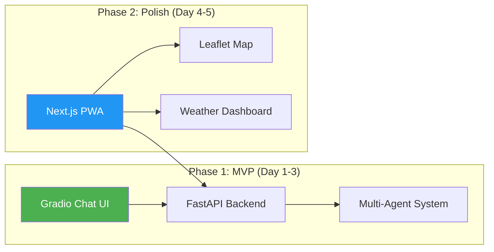
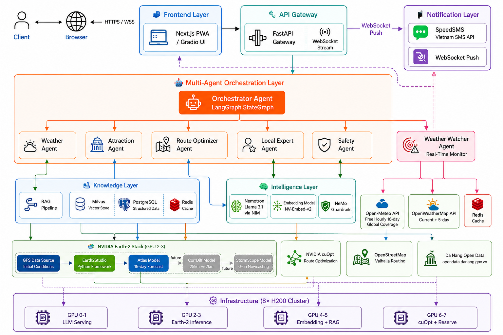
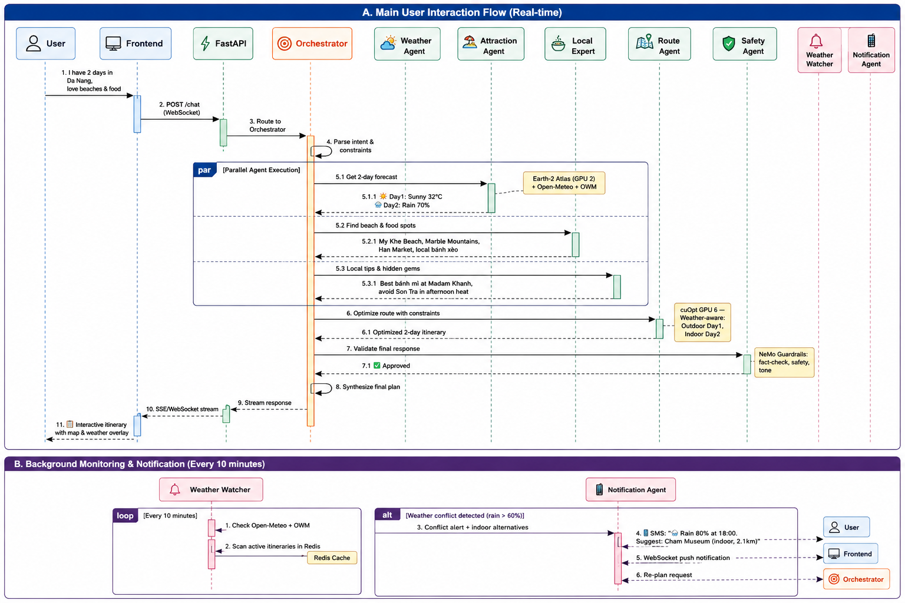
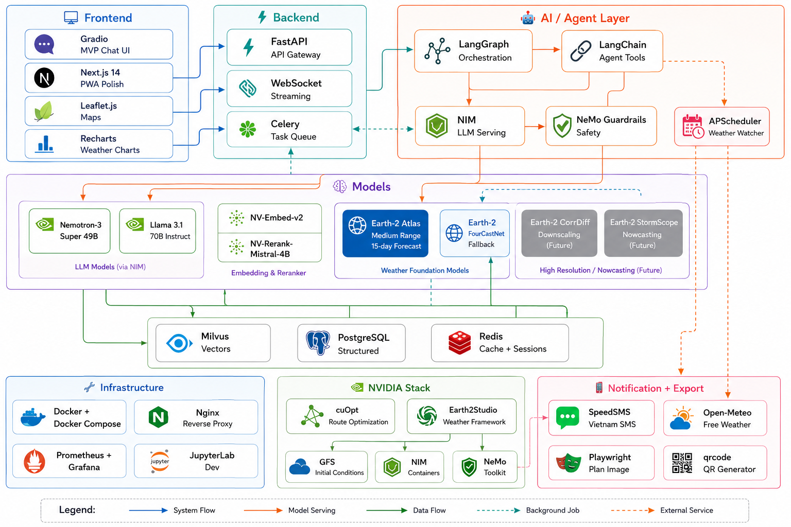

# 🌦️ Weatherise — Multi-Agent System for Travel Optimization in Da Nang City

> **Team:** Weatherise (4 members) 
> **Hackathon:** Vietnam AI Open Hackathon 2026

---

## 📋 Table of Contents

1. [Project Overview](#-project-overview)
2. [Why This Matters Now](#-why-this-matters-now)
3. [Platform Strategy](#-platform-strategy)
4. [System Architecture](#-system-architecture)
5. [Future Reuse & Enterprise Value](#-future-reuse--enterprise-value)

---

## 🎯 Project Overview

**Weatherise** is a **domain-agnostic Multi-Agent System (MAS)** that combines real-time weather intelligence with optimization algorithms to deliver hyper-personalized travel recommendations for Da Nang City. The system orchestrates specialized AI agents — each powered by GPU-accelerated models running on an 8× H200 cluster — to reason about weather forecasts, tourist attractions, route optimization, and local expertise simultaneously.

### Core Idea

```
User Query → Orchestrator Agent → [Weather Agent + Attraction Agent + Route Agent + Local Expert Agent] → Optimized Travel Plan
                                                          ↕ (real-time loop)
                                          Weather Watcher Agent → SMS / WebSocket Alert → Dynamic Re-plan
```

The architecture is built as a **reusable multi-agent framework** — swap the domain knowledge (travel → agriculture, logistics, disaster response) and the same agent orchestration, RAG pipeline, and optimization layer works across industries.

### Focus Areas

| Area | Description |
|------|-------------|
| 🌤️ **Weather** | 15-day forecasts via NVIDIA Earth-2 Atlas (Medium Range) through Earth2Studio + Open-Meteo (hourly detail) + OpenWeatherMap (current conditions) |
| ✈️ **Travel** | Personalized attraction recommendations with crowd-awareness |
| ⚡ **Optimization** | GPU-accelerated route optimization via NVIDIA cuOpt |
| 🔔 **Real-Time Alerts** | Proactive weather monitoring → SMS/WebSocket notification → auto re-plan outdoor activities |
| 📸 **Plan Export** | Save itinerary as beautiful image + QR code for offline access |
| 🔄 **Reusability** | Domain-agnostic MAS framework applicable to agriculture, logistics, etc. |

### Trip Duration

| Setting | Value | Reason |
|---------|-------|--------|
| Minimum | 1 day | Half-day/day trip |
| Default | 2-3 days | Most common Da Nang trip |
| **Recommended max** | **7 days** | Forecast accuracy high, itinerary quality optimal |
| Hard limit | 15 days | Earth-2 Atlas (Medium Range) forecast boundary |

---

## 🔥 Why This Matters Now

### Da Nang Tourism is Booming

- **2025:** 17.3M visitors (+15% YoY), VND 60 trillion revenue (+21%)
- **2026 target:** 19.5M visitors — first 5 months already at 7.74M (+20.9%)
- Da Nang named **Vietnam's Smart City for 6 consecutive years**
- City already deploying AI chatbots, AR experiences, and the "Danang Smart City" super-app

> **The problem:** Tourists still manually check weather, browse blogs, and guess which attractions to visit. There is no intelligent system that combines weather awareness with real-time travel optimization.

### Why Multi-Agent Systems?

| Fact | Source |
|------|--------|
| MAS market projected to reach $47.4B by 2030 (CAGR 45.8%) | MarketsandMarkets, 2025 |
| NVIDIA launched "Multi-Agent Intelligent Warehouse" blueprint at GTC 2026 | NVIDIA GTC 2026 |
| NeMo Agent Toolkit now supports framework-agnostic orchestration (LangChain, CrewAI, etc.) | NVIDIA, 2025 |
| EU Green Deal driving AI-powered agricultural optimization adoption | European Commission |
| 73% of enterprises plan to deploy agentic AI by 2027 | Gartner, 2025 |

### Why Weather × Travel?

- Weather is the **#1 factor** affecting tourist satisfaction (World Tourism Organization, UNWTO)
- 68% of travelers change plans due to unexpected weather (Booking.com Travel Report 2025)
- Climate volatility increasing — Da Nang faces typhoon season (Sep-Dec), extreme heat (Jun-Aug)

---

## 📱 Platform Strategy

### Recommended: **Web Application (Responsive PWA)** — NOT native mobile

For a 5-day hackathon with 4 members, here's the optimal strategy:

```
Day 1-3 (MVP):     Backend MAS + Gradio/Streamlit Chat UI
Day 4-5 (Polish):  Next.js Responsive PWA with map integration
```

### Why This Approach?

| Option | Build Time | Judge Experience | Recommendation |
|--------|-----------|-----------------|----------------|
| Native Mobile (React Native) | 3-4 days just for app | Can't test easily | ❌ Too risky |
| Backend-only system | 2-3 days | No visual demo | ❌ Not impressive |
| **Streamlit/Gradio → PWA** | **1 day UI + 2 days agents** | **Interactive demo** | **✅ Best ROI** |

### Platform Architecture



> **Judge Strategy:** Judges can open the web app on any device (laptop/phone). PWA feels like a native app. The Gradio fallback ensures the system is always demonstrable even if the frontend isn't ready.

---
## 🏗️ System Architecture

### High-Level Architecture

### Sequence Diagram

### Tech Stack 
