# 🌦️ Weatherise — Multi-Agent System for Travel Optimization in Da Nang City

> **Team:** Weatherise (4 members) | **Hackathon Duration:** 5 days (3 MVP + 2 Polish) | **Cluster:** 8× NVIDIA H200 GPUs

---

## 📋 Table of Contents

1. [Project Overview](#-project-overview)
2. [Why This Matters Now](#-why-this-matters-now)
3. [Platform Strategy](#-platform-strategy)
4. [System Architecture](#-system-architecture)
5. [Agent Design](#-agent-design) — 7 agents including 2 real-time background agents
6. [RAG Pipeline](#-rag-pipeline)
7. [Data & API Sources](#-data--api-sources) — 11 sources including Open-Meteo, SpeedSMS
8. [Tech Stack](#-tech-stack) — 31 technologies
9. [Cluster Utilization](#-cluster-utilization)
10. [User Input / Output](#-user-input--output) — includes real-time SMS alerts + plan export
11. [UI / Frontend Design](#-ui--frontend-design)
12. [Deployment](#-deployment)
13. [Monitoring & Observability](#-monitoring--observability)
14. [6-Day Plan](#-6-day-plan)
15. [Future Reuse & Enterprise Value](#-future-reuse--enterprise-value)

---

## 🎯 Project Overview

**Weatherise** is a **domain-agnostic Multi-Agent System (MAS)** that combines real-time weather intelligence with optimization algorithms to deliver hyper-personalized travel recommendations for Da Nang City. The system orchestrates specialized AI agents — each powered by GPU-accelerated models running on an 8× H200 cluster — to reason about weather forecasts, tourist attractions, route optimization, and local expertise simultaneously.

### Core Idea

```
User Query → Orchestrator Agent → [Weather Agent + Attraction Agent + Route Agent + Local Expert Agent] → Optimized Travel Plan
                                                          ↕ (real-time loop)
                                          Weather Watcher Agent → SMS / WebSocket Alert → Dynamic Re-plan
```

The architecture is built as a **reusable multi-agent framework** — swap the domain knowledge (travel → agriculture, logistics, disaster response) and the same agent orchestration, RAG pipeline, and optimization layer works across industries.

### Focus Areas

| Area | Description |
|------|-------------|
| 🌤️ **Weather** | Real-time & 15-day forecasts via NVIDIA Earth-2 + Open-Meteo + OpenWeatherMap |
| ✈️ **Travel** | Personalized attraction recommendations with crowd-awareness |
| ⚡ **Optimization** | GPU-accelerated route optimization via NVIDIA cuOpt |
| 🔔 **Real-Time Alerts** | Proactive weather monitoring → SMS/WebSocket notification → auto re-plan outdoor activities |
| 📸 **Plan Export** | Save itinerary as beautiful image + QR code for offline access |
| 🔄 **Reusability** | Domain-agnostic MAS framework applicable to agriculture, logistics, etc. |

### Trip Duration

| Setting | Value | Reason |
|---------|-------|--------|
| Minimum | 1 day | Half-day/day trip |
| Default | 2-3 days | Most common Da Nang trip |
| **Recommended max** | **7 days** | Forecast accuracy high, itinerary quality optimal |
| Hard limit | 15 days | Earth-2 Medium Range forecast boundary |

---

## 🔥 Why This Matters Now

### Da Nang Tourism is Booming

- **2025:** 17.3M visitors (+15% YoY), VND 60 trillion revenue (+21%)
- **2026 target:** 19.5M visitors — first 5 months already at 7.74M (+20.9%)
- Da Nang named **Vietnam's Smart City for 6 consecutive years**
- City already deploying AI chatbots, AR experiences, and the "Danang Smart City" super-app

> **The problem:** Tourists still manually check weather, browse blogs, and guess which attractions to visit. There is no intelligent system that combines weather awareness with real-time travel optimization.

### Why Multi-Agent Systems?

| Fact | Source |
|------|--------|
| MAS market projected to reach $47.4B by 2030 (CAGR 45.8%) | MarketsandMarkets, 2025 |
| NVIDIA launched "Multi-Agent Intelligent Warehouse" blueprint at GTC 2026 | NVIDIA GTC 2026 |
| NeMo Agent Toolkit now supports framework-agnostic orchestration (LangChain, CrewAI, etc.) | NVIDIA, 2025 |
| EU Green Deal driving AI-powered agricultural optimization adoption | European Commission |
| 73% of enterprises plan to deploy agentic AI by 2027 | Gartner, 2025 |

### Why Weather × Travel?

- Weather is the **#1 factor** affecting tourist satisfaction (World Tourism Organization, UNWTO)
- 68% of travelers change plans due to unexpected weather (Booking.com Travel Report 2025)
- Climate volatility increasing — Da Nang faces typhoon season (Sep-Dec), extreme heat (Jun-Aug)

---

## 📱 Platform Strategy

### Recommended: **Web Application (Responsive PWA)** — NOT native mobile

For a 5-day hackathon with 4 members, here's the optimal strategy:

```
Day 1-3 (MVP):     Backend MAS + Gradio/Streamlit Chat UI
Day 4-5 (Polish):  Next.js Responsive PWA with map integration
```

### Why This Approach?

| Option | Build Time | Judge Experience | Recommendation |
|--------|-----------|-----------------|----------------|
| Native Mobile (React Native) | 3-4 days just for app | Can't test easily | ❌ Too risky |
| Backend-only system | 2-3 days | No visual demo | ❌ Not impressive |
| **Streamlit/Gradio → PWA** | **1 day UI + 2 days agents** | **Interactive demo** | **✅ Best ROI** |

### Platform Architecture

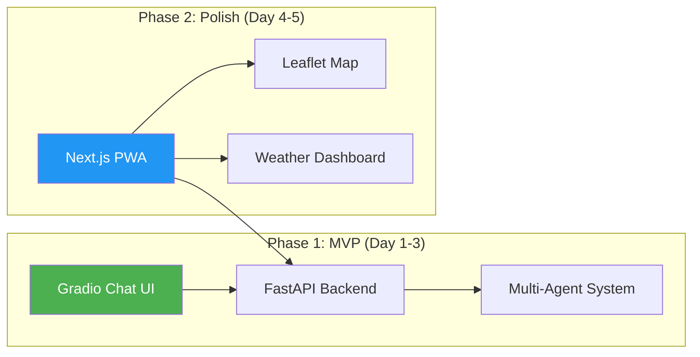

> **Judge Strategy:** Judges can open the web app on any device (laptop/phone). PWA feels like a native app. The Gradio fallback ensures the system is always demonstrable even if the frontend isn't ready.

---

## 🏗️ System Architecture

### High-Level Architecture

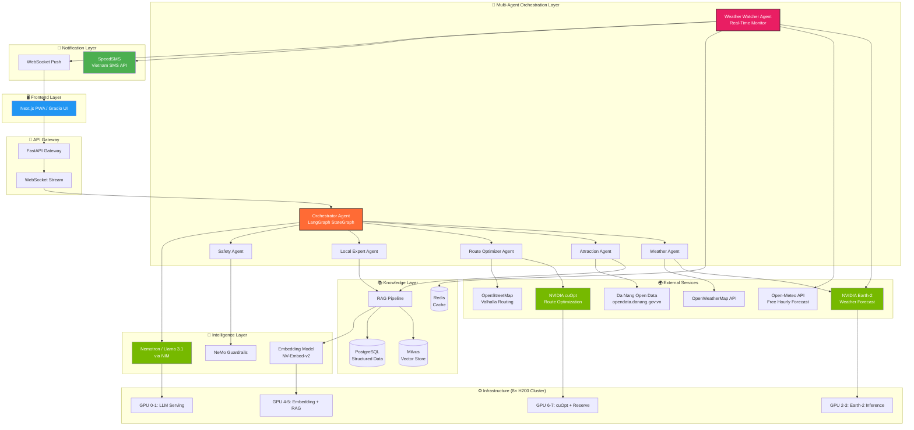

### Request Flow (Sequence Diagram)

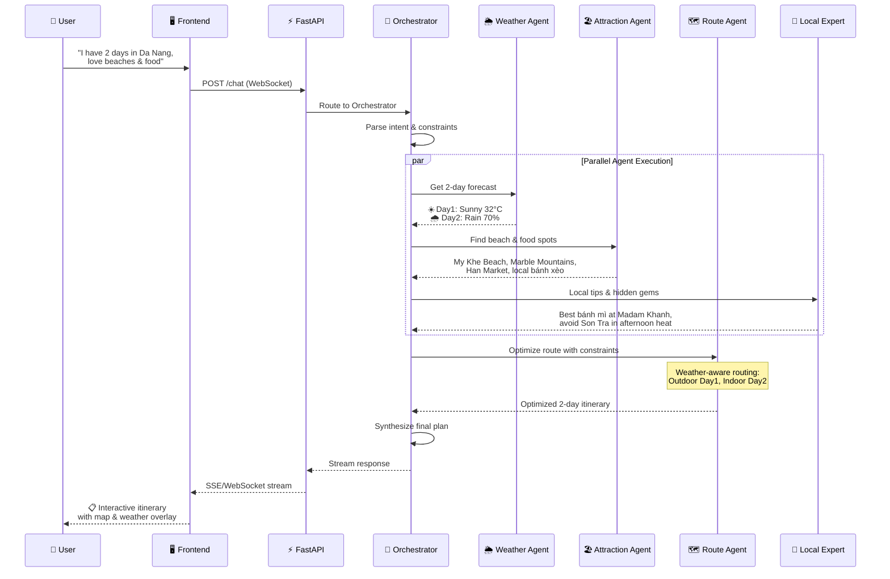

### Data Flow Architecture

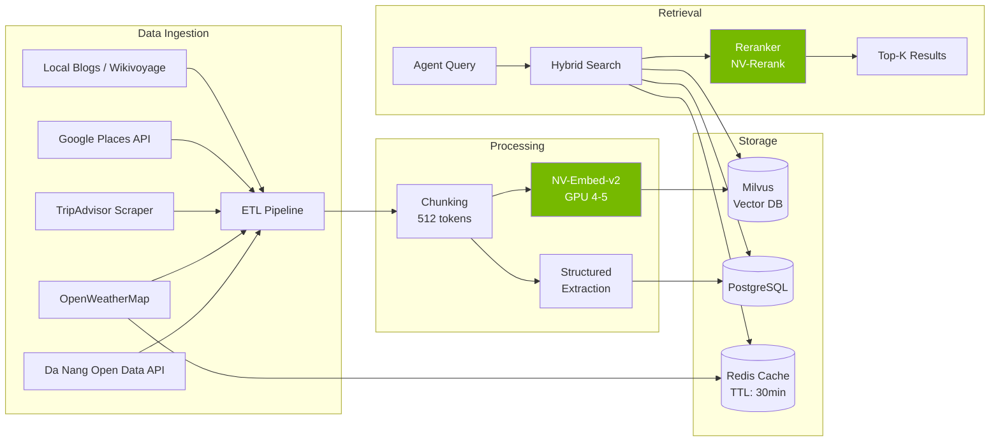

---

## 🤖 Agent Design

The system uses **7 specialized agents** coordinated by a central **Orchestrator** via LangGraph's `StateGraph`. Each agent is a self-contained module with its own tools, prompts, and data sources. This includes **2 real-time agents** (Weather Watcher + Notification) that run as background processes for proactive alerting.

### Agent Overview

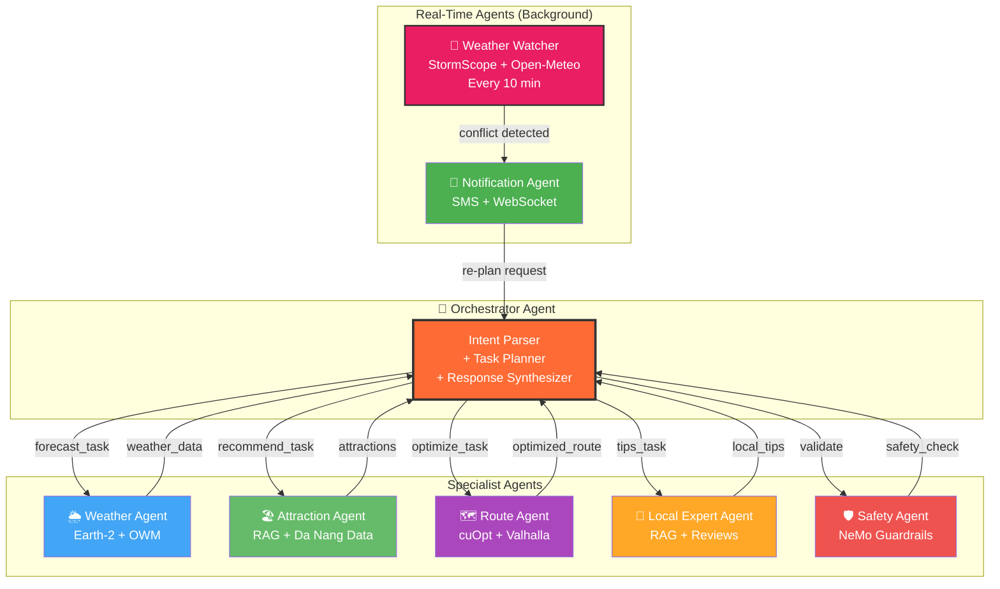

### Agent 1: 🎯 Orchestrator Agent

| Property | Detail |
|----------|--------|
| **Role** | Central coordinator — parses user intent, plans tasks, dispatches to specialists, synthesizes final response |
| **Framework** | LangGraph `StateGraph` with conditional edges |
| **LLM** | Nemotron Nano 8B (MVP) → Nemotron-3 Super 49B (Polish) via NIM |
| **State** | Shared `TypedDict` with `messages`, `weather`, `attractions`, `route`, `tips`, `plan` |
| **Pattern** | Supervisor-Subordinate with parallel fan-out |

**How to build (step-by-step):**

1. Define `AgentState` as a `TypedDict` with all shared fields
2. Create a LangGraph `StateGraph(AgentState)`
3. Add nodes: `parse_intent`, `weather_node`, `attraction_node`, `route_node`, `local_node`, `synthesize`
4. Add conditional edges from `parse_intent` → fan-out to relevant agents
5. Add edges from all agents → `synthesize` node
6. Compile graph with `checkpointer` for conversation memory

```python
# Pseudocode
from langgraph.graph import StateGraph, END

class AgentState(TypedDict):
    messages: list
    intent: dict
    weather: dict
    attractions: list
    route: dict
    local_tips: list
    final_plan: str

graph = StateGraph(AgentState)
graph.add_node("parse_intent", parse_intent_node)
graph.add_node("weather", weather_agent)
graph.add_node("attractions", attraction_agent)
graph.add_node("route", route_agent)
graph.add_node("local", local_expert_agent)
graph.add_node("synthesize", synthesize_node)

graph.set_entry_point("parse_intent")
graph.add_conditional_edges("parse_intent", route_to_agents)
graph.add_edge("weather", "synthesize")
graph.add_edge("attractions", "synthesize")
graph.add_edge("route", "synthesize")
graph.add_edge("local", "synthesize")
graph.add_edge("synthesize", END)

app = graph.compile()
```

**Tech stack:** `langgraph`, `langchain-core`, `pydantic`

---

### Agent 2: 🌦️ Weather Agent

| Property | Detail |
|----------|--------|
| **Role** | Fetches real-time weather + 15-day forecasts, interprets conditions for travel suitability |
| **Data Sources** | NVIDIA Earth-2 Studio (GPU inference), OpenWeatherMap API (fallback) |
| **Tools** | `get_current_weather`, `get_forecast_15d`, `assess_travel_suitability` |
| **Output** | Structured weather data with travel-impact scores (beach_score, hiking_score, etc.) |

**How to build:**

1. Set up Earth-2 Studio with `earth2studio` Python package on GPU 2-3
2. Load FourCastNet or Earth-2 Medium Range model for 15-day forecast
3. Create OpenWeatherMap API wrapper as fallback (free tier: 1000 calls/day)
4. Build `assess_travel_suitability()` tool — converts raw weather → activity scores
5. Wrap as LangChain `Tool` objects and bind to agent

**Tech stack:** `earth2studio`, `openweathermap-api`, `numpy`, `langchain tools`

---

### Agent 3: 🏖️ Attraction Agent

| Property | Detail |
|----------|--------|
| **Role** | Recommends attractions, restaurants, activities based on preferences, weather, and crowd levels |
| **Data Sources** | RAG over Da Nang knowledge base, Da Nang Open Data API, Google Places |
| **Tools** | `search_attractions`, `get_crowd_estimate`, `filter_by_weather`, `get_reviews` |
| **Output** | Ranked list of attractions with metadata (hours, cost, weather-suitability, crowd level) |

**How to build:**

1. Curate Da Nang attraction dataset (scrape TripAdvisor, Wikivoyage, local blogs)
2. Chunk documents (512 tokens, 50 overlap) and embed with NV-Embed-v2
3. Store in Milvus vector DB with metadata filters (category, location, indoor/outdoor)
4. Build hybrid search tool: vector similarity + metadata filter + keyword BM25
5. Add crowd estimation heuristic (time-of-day + day-of-week + season)
6. Create weather-aware filter: if rain → prioritize indoor; if sunny → outdoor

**Tech stack:** `langchain`, `milvus-lite`, `sentence-transformers`, `beautifulsoup4`

---

### Agent 4: 🗺️ Route Optimizer Agent

| Property | Detail |
|----------|--------|
| **Role** | Optimizes multi-stop itinerary considering time windows, weather, transport mode |
| **Data Sources** | NVIDIA cuOpt (GPU-accelerated VRP solver), Valhalla/OSRM (routing engine) |
| **Tools** | `optimize_route`, `get_travel_time`, `generate_map_url` |
| **Output** | Ordered itinerary with ETAs, transport modes, and alternative routes |

**How to build:**

1. Deploy NVIDIA cuOpt microservice on GPU 6-7 via Docker container
2. Set up Valhalla routing engine with OpenStreetMap data for Da Nang region
3. Build `optimize_route()`: takes list of waypoints + constraints → calls cuOpt API
4. Add time-window constraints (attraction open hours, meal times)
5. Add weather-aware constraints (move outdoor activities to sunny slots)
6. Return optimized sequence with directions and travel times

```python
# cuOpt integration pseudocode
import requests

def optimize_route(waypoints, time_windows, weather_constraints):
    payload = {
        "task_data": {
            "locations": [[wp.lat, wp.lng] for wp in waypoints],
            "time_windows": time_windows,
            "vehicle_count": 1,  # single tourist
        }
    }
    response = requests.post("http://cuopt-server:5000/cuopt/routes", json=payload)
    return response.json()["solution"]
```

**Tech stack:** `nvidia-cuopt`, `valhalla`, `osmnx`, `folium`

---

### Agent 5: 🍜 Local Expert Agent

| Property | Detail |
|----------|--------|
| **Role** | Provides insider tips, hidden gems, cultural context, safety info |
| **Data Sources** | RAG over curated local knowledge (blogs, forums, local guides) |
| **Tools** | `get_local_tips`, `get_food_recommendations`, `get_cultural_info` |
| **Output** | Contextual tips matching user's itinerary and preferences |

**How to build:**

1. Curate local knowledge base: Vietnamese food blogs, Reddit r/danang, expat forums
2. Structure tips by category: food, culture, transport, safety, budget
3. Embed and store in same Milvus instance (separate collection)
4. Build retrieval tool with preference-aware filtering
5. Add LLM post-processing to personalize tips to user context

**Tech stack:** `langchain`, `milvus`, `trafilatura` (web scraping)

---

### Agent 6: 🛡️ Safety Agent (NeMo Guardrails)

| Property | Detail |
|----------|--------|
| **Role** | Validates all agent outputs for safety, accuracy, and policy compliance |
| **Framework** | NVIDIA NeMo Guardrails |
| **Checks** | Factual grounding, off-topic rejection, harmful content filter, hallucination detection |

**How to build:**

1. Install `nemoguardrails` package
2. Define Colang rules for: topic boundaries, factual grounding, safety
3. Add input rails (block inappropriate queries) and output rails (verify agent responses)
4. Integrate as final validation step before response reaches user

**Tech stack:** `nemoguardrails`, `colang`

---

### Agent 7: 🔔 Weather Watcher Agent (Real-Time Background)

| Property | Detail |
|----------|--------|
| **Role** | Continuously monitors weather and detects conflicts with active itineraries |
| **Trigger** | APScheduler background job, runs **every 10 minutes** |
| **Data Sources** | Earth-2 StormScope (GPU 2-3, 0-6hr nowcast, 3km resolution, 10-min intervals), Open-Meteo API (free, hourly, no API key) |
| **Logic** | 30 minutes before each outdoor activity → check latest forecast → if rain >60% or extreme heat >38°C → flag conflict |
| **Output** | Conflict alert → triggers Notification Agent → triggers Orchestrator re-plan |

**How to build:**

1. Install `apscheduler` for background job scheduling
2. Create `weather_watcher.py` — runs every 10 min, queries Earth-2 StormScope + Open-Meteo for Da Nang (lat: 16.0544, lng: 108.2022)
3. Fetch all active itineraries from Redis (`session:* → {itinerary, phone}`)
4. For each upcoming outdoor activity (within next 2 hours): compare forecast vs activity type
5. If conflict detected → push to Notification Agent with conflict details + 2-3 indoor alternatives from RAG

```python
# Weather Watcher pseudocode
from apscheduler.schedulers.background import BackgroundScheduler
import httpx

async def watch_weather():
    # 1. Get latest forecast from Open-Meteo (FREE, no key)
    forecast = await httpx.get(
        "https://api.open-meteo.com/v1/forecast",
        params={
            "latitude": 16.0544, "longitude": 108.2022,
            "hourly": "precipitation_probability,temperature_2m,weathercode",
            "timezone": "Asia/Ho_Chi_Minh", "forecast_days": 2
        }
    )
    
    # 2. Scan active itineraries in Redis
    for session in redis.scan_iter("session:*"):
        itinerary = redis.hgetall(session)
        for item in itinerary["plan"]:
            if item["type"] == "outdoor" and is_within_2_hours(item["time"]):
                rain_prob = get_rain_prob_at(forecast, item["time"])
                if rain_prob > 60:
                    # 3. Trigger re-plan + notification
                    await notify_agent.send_alert(session, item, rain_prob)

scheduler = BackgroundScheduler()
scheduler.add_job(watch_weather, 'interval', minutes=10)
```

**Tech stack:** `apscheduler`, `httpx`, `redis`, `earth2studio`

---

### Agent 8: 📱 Notification Agent (SMS + WebSocket)

| Property | Detail |
|----------|--------|
| **Role** | Delivers weather alerts and re-planned itinerary to users via SMS and/or WebSocket |
| **SMS Provider** | SpeedSMS (Vietnamese local, ~350 VND/msg, free trial available) |
| **WebSocket** | FastAPI WebSocket (already in architecture) — for users with app open |
| **Phone Format** | Vietnamese numbers only: 09x, 03x, 07x, 08x, 05x (10 digits) |

**How to build:**

1. Create SMS service wrapper using SpeedSMS REST API
2. Create WebSocket broadcast function for connected sessions
3. On conflict alert from Weather Watcher:
   - Query RAG for indoor alternatives near affected location
   - Re-optimize route via cuOpt with new indoor stops
   - Generate human-readable message via LLM
   - Send via SMS (if phone registered) AND WebSocket (if connected)

```python
# SpeedSMS integration
import requests

def send_sms_alert(phone: str, message: str):
    """Send SMS to Vietnamese phone number via SpeedSMS"""
    response = requests.post(
        "https://api.speedsms.vn/index.php/sms/send",
        auth=(SPEEDSMS_TOKEN, 'x'),
        json={
            "to": [phone],           # e.g., "0901234567"
            "content": message,       # Max ~140 chars for 1 segment
            "sms_type": 2,            # Customer care (CSKH)
            "sender": "Weatherise"
        }
    )
    return response.json()

# Example SMS content (~135 chars = 1 message):
# "🌧️ Weatherise: Mưa 80% lúc 18:00 tại Sơn Trà.
#  Đề xuất: Bảo tàng Chăm (indoor, 2.1km).
#  Chi tiết: weatherise.app/p/abc123"
```

**SMS costs:** ~350 VND/msg ($0.014). Free trial: 2,000 VND ≈ 5-6 messages (enough for hackathon demo).

**Tech stack:** `speedsms-api` (REST), `fastapi[websockets]`, `redis`

---

### Agent Communication Protocol

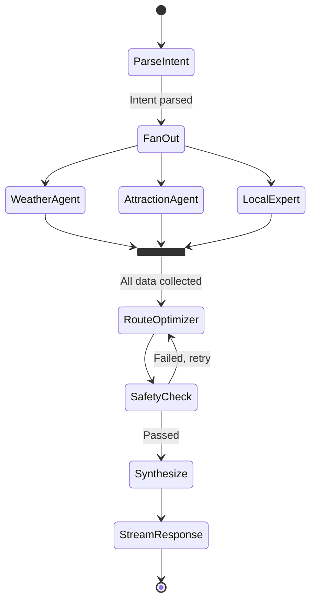

---

## 📚 RAG Pipeline

The RAG (Retrieval-Augmented Generation) system is the knowledge backbone powering the Attraction Agent and Local Expert Agent.

### RAG Architecture

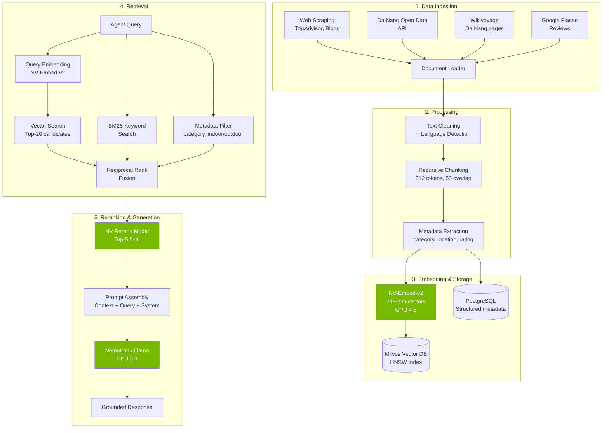

### Step-by-Step Build Guide

#### Step 1: Data Collection (Day 1)

```bash
# Tools needed
pip install trafilatura beautifulsoup4 requests langchain-community
```

| Source | Method | Est. Documents |
|--------|--------|---------|
| Da Nang Open Data | REST API (`opendata.danang.gov.vn`) | ~200 datasets |
| TripAdvisor | Scrape top 100 attractions + reviews | ~2,000 docs |
| Wikivoyage | Parse Da Nang, Hoi An pages | ~50 docs |
| Local food blogs | Trafilatura extraction | ~300 docs |
| Google Places | Places API (nearby search) | ~500 docs |

#### Step 2: Processing (Day 1)

```python
from langchain.text_splitter import RecursiveCharacterTextSplitter

splitter = RecursiveCharacterTextSplitter(
    chunk_size=512,
    chunk_overlap=50,
    separators=["\n\n", "\n", ". ", " "]
)

# Process each document
for doc in documents:
    chunks = splitter.split_text(doc.text)
    for chunk in chunks:
        metadata = {
            "source": doc.source,
            "category": classify_category(chunk),  # food, beach, temple, etc.
            "location": extract_location(chunk),     # lat/lng if available
            "indoor_outdoor": classify_indoor(chunk), # for weather filtering
            "language": detect_language(chunk),
        }
```

#### Step 3: Embedding (Day 1-2)

```python
# Using NV-Embed-v2 on GPU 4-5
from langchain_nvidia_ai_endpoints import NVIDIAEmbeddings

embeddings = NVIDIAEmbeddings(
    model="nvidia/nv-embedqa-e5-v5",  # or NV-Embed-v2
    base_url="http://localhost:8001/v1",  # local NIM endpoint
)

# Batch embed all chunks
vectors = embeddings.embed_documents([chunk.text for chunk in all_chunks])
```

#### Step 4: Vector Store (Day 2)

```python
from langchain_milvus import Milvus

vectorstore = Milvus(
    embedding_function=embeddings,
    collection_name="danang_travel",
    connection_args={"host": "localhost", "port": "19530"},
)

# Insert with metadata
vectorstore.add_documents(all_chunks)
```

#### Step 5: Hybrid Retrieval (Day 2)

```python
from langchain.retrievers import EnsembleRetriever
from langchain_community.retrievers import BM25Retriever

# Vector retriever
vector_retriever = vectorstore.as_retriever(
    search_type="mmr",
    search_kwargs={"k": 20, "fetch_k": 50}
)

# BM25 retriever
bm25_retriever = BM25Retriever.from_documents(all_chunks, k=20)

# Ensemble with Reciprocal Rank Fusion
ensemble = EnsembleRetriever(
    retrievers=[vector_retriever, bm25_retriever],
    weights=[0.6, 0.4]
)
```

#### Step 6: Reranking (Day 2)

```python
from langchain.retrievers import ContextualCompressionRetriever
from langchain_nvidia_ai_endpoints import NVIDIARerank

reranker = NVIDIARerank(
    model="nvidia/nv-rerankqa-mistral-4b-v3",
    base_url="http://localhost:8002/v1",
    top_n=5
)

final_retriever = ContextualCompressionRetriever(
    base_compressor=reranker,
    base_retriever=ensemble
)
```

### RAG Tech Stack Summary

| Component | Technology | GPU Required? |
|-----------|-----------|---------------|
| Embedding | NV-Embed-v2 (768d) | ✅ GPU 4-5 |
| Vector DB | Milvus (HNSW index) | ❌ CPU |
| Keyword Search | BM25 (rank-bm25) | ❌ CPU |
| Reranker | NV-Rerank-Mistral-4B | ✅ GPU 4-5 |
| Fusion | Reciprocal Rank Fusion | ❌ CPU |
| Structured DB | PostgreSQL | ❌ CPU |
| Cache | Redis (TTL 30min for weather) | ❌ CPU |
| LLM Generation | Nemotron / Llama 3.1 70B | ✅ GPU 0-1 |

---

## 🌍 Data & API Sources

### Primary Data Sources

| # | Source | Type | Data Provided | Access |
|---|--------|------|---------------|--------|
| 1 | **NVIDIA Earth-2 Studio** | GPU Inference | 15-day weather forecasts, 70+ variables, km-scale resolution | Self-hosted on GPU 2-3 |
| 2 | **NVIDIA Earth-2 StormScope** | GPU Inference | 0-6hr nowcasting, 3km resolution, 10-min intervals — **real-time** | Self-hosted on GPU 2-3 |
| 3 | **Open-Meteo API** | REST API | Hourly forecast, precipitation probability, 16-day range | **FREE**, no API key, 10k calls/day |
| 4 | **OpenWeatherMap API** | REST API | Current weather, 5-day forecast, UV index, air quality | Free tier: 1,000 calls/day |
| 5 | **Da Nang Open Data** (`opendata.danang.gov.vn`) | REST API | 1,200+ datasets: tourism, transport, accommodation, environment | Free, public API |
| 6 | **Google Places API** | REST API | Attractions, restaurants, reviews, photos, hours, ratings | $200 free credit/month |
| 7 | **OpenStreetMap** | Map Data | Road network, POIs, building footprints for Da Nang | Free, open source |
| 8 | **TripAdvisor** | Web Scraping | Top 100 attractions, 2,000+ reviews | Scrape (ethical) |
| 9 | **Wikivoyage** | Web Scraping | Da Nang travel guides, cultural info, practical tips | Free, CC license |
| 10 | **Danang Fantasticity** (`danangfantasticity.com`) | Web Scraping | Official tourism portal: events, attractions, festivals | Free, public |
| 11 | **SpeedSMS** | REST API | SMS delivery to Vietnamese phone numbers (Viettel, Mobi, Vina) | ~350 VND/msg, free trial |

### Data Pipeline

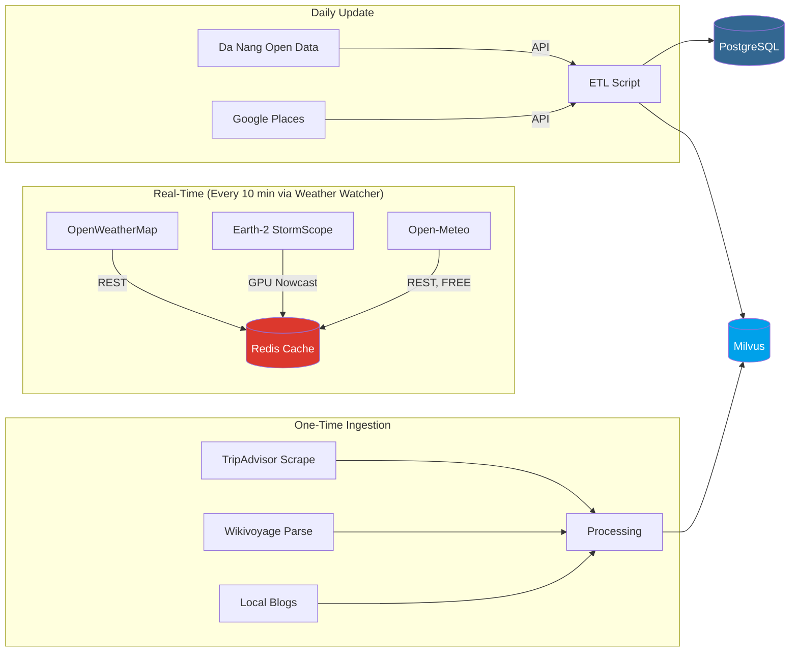

---

## 🛠️ Tech Stack

### Complete Tech Stack Map

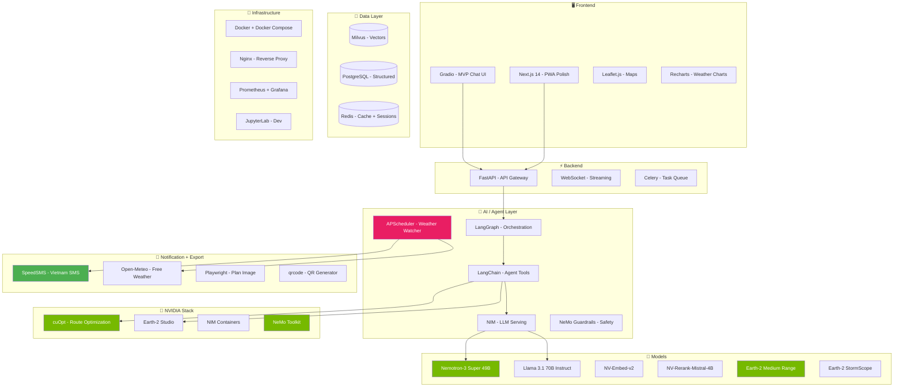

### Stack by Category

| Category | Technology | Version | Purpose |
|----------|-----------|---------|---------|
| **Language** | Python | 3.11+ | Primary backend language |
| **Language** | TypeScript | 5.x | Frontend (Next.js) |
| **Agent Framework** | LangGraph | 0.2+ | Multi-agent orchestration |
| **Agent Framework** | LangChain | 0.3+ | Tool binding, chains |
| **LLM Serving** | NIM (NVIDIA Inference Microservice) | Latest | OpenAI-compatible LLM serving, optimized for H200 |
| **LLM Model** | Nemotron-3 Super | 49B | Primary reasoning LLM |
| **LLM Model** | Llama 3.1 Instruct | 70B | Alternative / fallback LLM |
| **Embedding** | NV-Embed-v2 | - | Document & query embeddings |
| **Reranker** | NV-Rerank-Mistral | 4B | Search result reranking |
| **Weather AI** | Earth-2 Studio | Latest | GPU weather forecasting |
| **Optimization** | NVIDIA cuOpt | Latest | Route optimization (VRP) |
| **Safety** | NeMo Guardrails | 0.10+ | Input/output validation |
| **Vector DB** | Milvus | 2.4+ | Vector similarity search |
| **SQL DB** | PostgreSQL | 16 | Structured data storage |
| **Cache** | Redis | 7+ | Weather cache, session store |
| **API** | FastAPI | 0.110+ | REST + WebSocket gateway |
| **Task Queue** | Celery + Redis | 5+ | Async background tasks |
| **Frontend (MVP)** | Gradio | 5+ | Quick chat interface |
| **Frontend (Polish)** | Next.js | 14+ | Production PWA |
| **Maps** | Leaflet.js | 1.9+ | Interactive map rendering |
| **Charts** | Recharts | 2+ | Weather data visualization |
| **Container** | Docker + NIM | Latest | GPU services via NIM, non-GPU via Docker Compose |
| **Proxy** | Nginx | Latest | Load balancer + SSL |
| **Monitoring** | Prometheus + Grafana | Latest | Metrics & dashboards |
| **Tracing** | LangSmith / Phoenix | Latest | Agent trace debugging |
| **Dev** | JupyterLab | 4+ | Notebook experimentation |
| **Scheduler** | APScheduler | 3.10+ | Weather Watcher background job (every 10 min) |
| **SMS** | SpeedSMS API | REST | Vietnamese SMS notifications (~350 VND/msg) |
| **Weather (Free)** | Open-Meteo API | REST | Free hourly forecast, no API key required |
| **QR Code** | qrcode + Pillow | Latest | Plan export as QR code image |
| **HTML→Image** | Playwright | Latest | Render itinerary as beautiful PNG for sharing |

---

## 🖥️ Cluster Utilization

### 8× NVIDIA H200 GPU Allocation

Each H200 has **141 GB HBM3e** memory and **4.8 TB/s** bandwidth. Total cluster: **~1.1 TB GPU memory**.

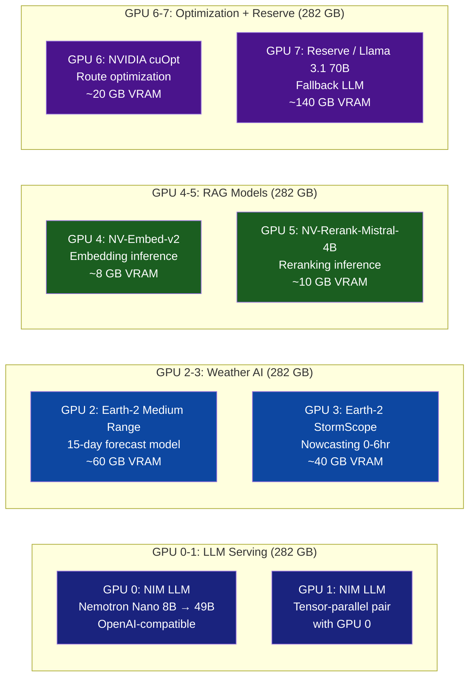

### Resource Breakdown

| GPU Pair | Service | VRAM Used | VRAM Free | CPU RAM | NVMe |
|----------|---------|-----------|-----------|---------|------|
| GPU 0-1 | NIM LLM (Nemotron Nano 8B → 49B) | ~200 GB | ~82 GB | 256 GB | 4 TB (model cache) |
| GPU 2-3 | Earth-2 Studio | ~100 GB | ~182 GB | 256 GB | 4 TB (weather data) |
| GPU 4-5 | NV-Embed + NV-Rerank | ~18 GB | ~264 GB | 128 GB | 2 TB (vector index) |
| GPU 6-7 | cuOpt + Llama fallback | ~160 GB | ~122 GB | 256 GB | 4 TB (OSM data) |
| **Total** | | **~478 GB** | **~650 GB** | **~2 TB** | **~28 TB** |

> **Cluster utilization: ~42% VRAM** — plenty of headroom for scaling, batch jobs, or additional models.

### Storage Allocation (28 TB NVMe)

| Purpose | Size | Location |
|---------|------|----------|
| Model weights (LLMs, embeddings) | ~500 GB | `/models/` |
| Earth-2 weather data (ERA5, GFS) | ~2 TB | `/data/weather/` |
| Milvus vector index | ~100 GB | `/data/milvus/` |
| PostgreSQL data | ~50 GB | `/data/postgres/` |
| OpenStreetMap (Da Nang region) | ~10 GB | `/data/osm/` |
| Docker images & layers | ~200 GB | `/var/lib/docker/` |
| JupyterLab workspace | ~100 GB | `/workspace/` |
| Logs & monitoring data | ~50 GB | `/logs/` |
| **Reserved / Free** | **~25 TB** | - |

---

## 📥 User Input / Output

### What the User Provides (Input)

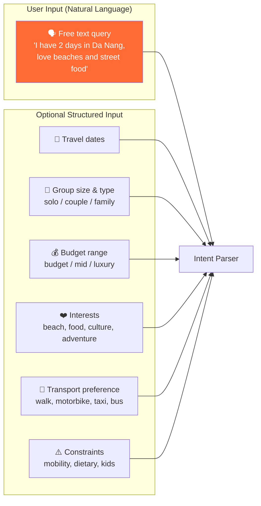

### What the User Receives (Output)

| Output Component | Description | Format |
|-----------------|-------------|--------|
| 🌦️ **Weather Brief** | Current + forecast for travel dates with activity suitability scores | Card with icons |
| 📋 **Day-by-Day Itinerary** | Optimized schedule with times, locations, descriptions (1-7 days) | Timeline view |
| 🗺️ **Interactive Map** | All waypoints on Leaflet map with route lines and directions | Embedded map |
| 🍜 **Food Recommendations** | Restaurants & street food matched to locations and preferences | Cards with ratings |
| 💡 **Local Tips** | Insider advice, cultural notes, money-saving tips | Collapsible list |
| ⏱️ **Travel Times** | Estimated transit time between each stop | Inline in itinerary |
| 🔄 **Alternatives** | Rainy-day backup plan if weather changes | Toggle view |
| 📊 **Budget Estimate** | Estimated cost breakdown for activities, food, transport | Summary table |
| 📸 **Plan Export** | Beautiful PNG image of itinerary + QR code to reopen on web | Download button |
| 🔔 **Real-Time SMS Alerts** | Weather change notification 30 min before outdoor activities (opt-in, VN phone) | SMS message |
| ⚡ **Live Re-Planning** | Auto-suggested indoor alternatives when weather turns bad — powered by Earth-2 StormScope real-time nowcasting on 8×H200 cluster | WebSocket push + SMS |

### Example Interaction

```
┌──────────────────────────────────────────────────────────────┐
│ 👤 USER:                                                     │
│ "I'm visiting Da Nang next weekend with my girlfriend.       │
│  We love seafood and want to see the Marble Mountains.       │
│  Budget is moderate. We prefer motorbike."                   │
├──────────────────────────────────────────────────────────────┤
│ 🤖 WEATHERISE:                                               │
│                                                              │
│ 🌤️ Weather Outlook (Jun 7-8):                                │
│ • Saturday: ☀️ 33°C, UV High — great for beaches (AM)       │
│ • Sunday: 🌦️ 28°C, 60% rain PM — plan indoor afternoon     │
│                                                              │
│ 📋 Your Optimized 2-Day Itinerary:                           │
│                                                              │
│ DAY 1 (Saturday — Sunny) ☀️                                  │
│ 06:00  🏖️ My Khe Beach — sunrise swim (free)                │
│ 08:30  🍜 Bánh mì Madam Khanh (20k VND)                     │
│ 10:00  ⛰️ Marble Mountains — climb to viewpoint (40k VND)   │
│ 12:30  🦐 Bé Mặn Seafood — ocean view lunch (~300k VND)     │
│ 15:00  🌉 Dragon Bridge area — café & rest                   │
│ 18:00  🌅 Son Tra Peninsula — sunset viewpoint               │
│ 19:30  🍲 Hải sản Phước Mỹ — dinner (~400k VND)             │
│                                                              │
│ DAY 2 (Sunday — Rain PM) 🌧️                                  │
│ 07:00  🏖️ An Bàng Beach, Hội An (motorbike 30 min)          │
│ 11:00  🏮 Hội An Ancient Town — walking tour                 │
│ 13:00  🍜 Cao Lầu & Cơm Gà — local Hội An lunch            │
│ 15:00  ☕ Indoor: Reaching Out Tea House (rain backup)       │
│ 17:00  🏠 Return to Da Nang                                  │
│                                                              │
│ 🗺️ [Interactive Map with Route]                              │
│ 💰 Est. Total: ~1,200,000 VND ($48) for 2 people            │
│ 💡 Tip: Rent motorbike at hotel (~150k/day). Wear helmet!   │
│                                                              │
│ [📸 Save as Image]  [📱 QR Code]  [🔔 SMS Alerts]           │
├──────────────────────────────────────────────────────────────┤
│ 📱 Want real-time weather alerts via SMS?                    │
│ Enter your VN phone: [09________] [✅ Enable]               │
│ We'll notify you 30 min before outdoor plans if rain is     │
│ coming, with indoor alternatives suggested by AI.           │
└──────────────────────────────────────────────────────────────┘
```

---

## 🎨 UI / Frontend Design

### Design Philosophy

> **"Weather-aware, map-centric, conversational-first"** — The UI should feel like chatting with a knowledgeable local friend who also shows you a live map.

### Color Palette

| Role | Color | Hex | Usage |
|------|-------|-----|-------|
| **Primary** | Ocean Blue | `#0EA5E9` | Headers, primary buttons, links |
| **Secondary** | Sunset Orange | `#F97316` | CTAs, highlights, agent indicators |
| **Accent** | Tropical Green | `#10B981` | Success states, weather-good |
| **Warning** | Amber | `#F59E0B` | Weather caution, moderate conditions |
| **Danger** | Coral Red | `#EF4444` | Weather alerts, typhoon warnings |
| **Background** | Deep Navy | `#0F172A` | Dark mode background |
| **Surface** | Slate | `#1E293B` | Cards, panels |
| **Text Primary** | White | `#F8FAFC` | Main text (dark mode) |
| **Text Secondary** | Cool Gray | `#94A3B8` | Secondary text, labels |
| **Gradient Start** | Sky Blue | `#38BDF8` | Hero gradients |
| **Gradient End** | Indigo | `#6366F1` | Hero gradients |

### Typography

| Element | Font | Weight | Size |
|---------|------|--------|------|
| Headings | **Inter** | 700 (Bold) | 24-32px |
| Body | **Inter** | 400 (Regular) | 14-16px |
| Code/Data | **JetBrains Mono** | 400 | 13px |
| Vietnamese | **Be Vietnam Pro** | 400-600 | 14-16px |

### UI Layout (Desktop)

```
┌─────────────────────────────────────────────────────────────────┐
│  🌦️ Weatherise        [Da Nang]  [☀️ 32°C]      [EN/VI]  [👤]  │
├────────────────────┬────────────────────────────────────────────┤
│                    │                                            │
│   💬 CHAT PANEL    │         🗺️ INTERACTIVE MAP                │
│                    │                                            │
│  ┌──────────────┐  │    ┌────────────────────────────────┐     │
│  │ Weather Card │  │    │                                │     │
│  │ ☀️ 32°C Sunny │  │    │   [Leaflet Map with markers,   │     │
│  │ Beach: 9/10  │  │    │    route lines, weather        │     │
│  └──────────────┘  │    │    overlay, and POI clusters]   │     │
│                    │    │                                │     │
│  🤖 Here's your   │    │         📍 My Khe Beach         │     │
│  optimized plan:   │    │         📍 Marble Mountains     │     │
│                    │    │         📍 Han Market            │     │
│  📋 Day 1:         │    │                                │     │
│  06:00 🏖️ Beach   │    └────────────────────────────────┘     │
│  08:30 🍜 Bánh mì │                                            │
│  10:00 ⛰️ Marble  │    ┌────────────────────────────────┐     │
│  ...               │    │ 📊 Weather Forecast Chart       │     │
│                    │    │  [7-day temp + rain bar chart]  │     │
│  ┌──────────────┐  │    └────────────────────────────────┘     │
│  │ 💬 Type here │  │                                            │
│  └──────────────┘  │    [📸 Save Image] [📱 QR] [🔔 SMS]      │
├────────────────────┴────────────────────────────────────────────┤
│  💰 Budget: ~1.2M VND │ 🕐 2 days │ 📍 8 stops │ 🔔 SMS: ON  │
└─────────────────────────────────────────────────────────────────┘
```

### UI Layout (Mobile PWA)

```
┌─────────────────────┐
│ 🌦️ Weatherise  [≡]  │
├─────────────────────┤
│ ☀️ 32°C | Da Nang   │
│ Beach: 9/10 🏖️      │
├─────────────────────┤
│                     │
│   [Map - Half]      │
│   📍 📍 📍           │
│                     │
├─────────────────────┤
│ 🤖 Your 2-day plan: │
│                     │
│ Day 1 ☀️             │
│ 06:00 🏖️ My Khe    │
│ 08:30 🍜 Bánh mì   │
│ 10:00 ⛰️ Marble    │
│                     │
│ Day 2 🌧️            │
│ 07:00 🏮 Hội An    │
│ ...                 │
├─────────────────────┤
│ [📸] [📱 QR] [🔔]  │
├─────────────────────┤
│ [💬 Ask anything..] │
└─────────────────────┘
```

### Key UI Components

| Component | Library | Description |
|-----------|---------|-------------|
| Chat Interface | Gradio `ChatInterface` → Next.js custom | Streaming chat with markdown support |
| Map View | Leaflet.js + React-Leaflet | Markers, polylines, weather overlay |
| Weather Cards | Custom React components | Temp, humidity, UV, activity scores |
| Itinerary Timeline | Custom CSS timeline | Vertical timeline with time + icons |
| Forecast Chart | Recharts `AreaChart` | 7-day temperature + precipitation |
| Budget Summary | Custom table component | Breakdown by category |
| Agent Status | Custom indicators | Show which agents are working |
| **Weather Alert Banner** | Custom React component | Slide-down alert with re-plan suggestions + Accept/Modify/Keep buttons |
| **Plan Export** | Playwright (server-side) + qrcode | Render itinerary as beautiful PNG + QR code for web access |
| **SMS Opt-In Form** | Custom React form | Phone input (VN format 09x) + enable/disable SMS alerts |

### Design Micro-Interactions

- 🔄 **Agent thinking animation** — pulsing dots showing which agent is active
- 🗺️ **Map auto-pan** — map smoothly pans to each location as itinerary streams
- 🌡️ **Weather transitions** — background gradient shifts with forecast (blue→orange→gray)
- ✨ **Card reveal** — itinerary cards slide in as agents return results
- 📍 **Marker bounce** — map markers bounce when mentioned in chat
- 🔔 **Alert slide-down** — weather alert banner slides from top with amber glow when Weather Watcher detects conflict
- 📸 **Export animation** — shimmer effect while server renders itinerary image

---

## 🚀 Deployment

### Deployment Architecture

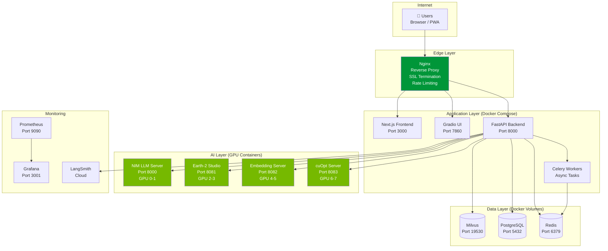

### Deployment Strategy

> **NOTE:** On the hackathon H200 cluster, GPU services are deployed as **individual Docker containers using NIM** (via `docker run --gpus`), NOT via Docker Compose (which doesn't support the `--gpus` flag directly). Non-GPU services (Redis, Milvus, PostgreSQL) can optionally use Docker Compose.

#### GPU Services (NIM containers — individual `docker run`)

```bash
# 0. Set NGC API Key (provided by VTS)
export NGC_API_KEY=<key-from-VTS>

# 1. LLM — GPU 0-1 (OpenAI-compatible API on port 8000)
docker run -d --name nim-llm \
  --gpus '"device=0,1"' --shm-size=16g \
  -e NGC_API_KEY -v /raid/nim-cache:/opt/nim/.cache \
  -p 8000:8000 \
  nvcr.io/nim/nvidia/llama-3.1-nemotron-nano-8b-v1:latest

# 2. Embedding — GPU 4 (port 8001)
docker run -d --name nim-embed \
  --gpus '"device=4"' --shm-size=8g \
  -e NGC_API_KEY -v /raid/nim-cache:/opt/nim/.cache \
  -p 8001:8000 \
  nvcr.io/nim/nvidia/nv-embedqa-e5-v5:latest

# 3. Reranker — GPU 5 (port 8002)
docker run -d --name nim-rerank \
  --gpus '"device=5"' --shm-size=8g \
  -e NGC_API_KEY -v /raid/nim-cache:/opt/nim/.cache \
  -p 8002:8000 \
  nvcr.io/nim/nvidia/nv-rerankqa-mistral-4b-v3:latest

# 4. cuOpt — GPU 6 (port 8083)
docker run -d --name cuopt \
  --gpus '"device=6"' \
  -e NGC_API_KEY -v /raid/nim-cache:/opt/nim/.cache \
  -p 8083:5000 \
  nvcr.io/nvidia/cuopt:latest

# 5. Earth-2 — GPU 2-3 (runs in JupyterLab Python, not container)
# pip install earth2studio  # inside JupyterLab
```

#### Non-GPU Services (Docker Compose)

```yaml
# docker-compose.data.yml — non-GPU services only
version: "3.9"
services:
  # --- Backend ---
  api:
    build: ./backend
    ports: ["8888:8888"]  # FastAPI on different port from JupyterLab
    network_mode: host     # Access NIM containers on localhost
    environment:
      - LLM_BASE_URL=http://localhost:8000/v1
      - EMBED_BASE_URL=http://localhost:8001/v1
      - RERANK_BASE_URL=http://localhost:8002/v1
      - CUOPT_URL=http://localhost:8083
      - OPEN_METEO_BASE=https://api.open-meteo.com/v1
      - SPEEDSMS_TOKEN=${SPEEDSMS_TOKEN}
      - WEATHER_WATCH_INTERVAL=600

  # --- Data Layer ---
  postgres:
    image: postgres:16
    ports: ["5432:5432"]
    environment:
      POSTGRES_PASSWORD: weatherise
      POSTGRES_DB: weatherise
    volumes: ["/raid/team/weatherise/data/postgres:/var/lib/postgresql/data"]

  redis:
    image: redis:7-alpine
    ports: ["6379:6379"]
    volumes: ["/raid/team/weatherise/data/redis:/data"]
    command: --appendonly yes

  milvus:
    image: milvusdb/milvus:latest
    ports: ["19530:19530", "9091:9091"]
    environment:
      ETCD_USE_EMBED: "true"
      COMMON_STORAGETYPE: local
    volumes: ["/raid/team/weatherise/data/milvus:/var/lib/milvus"]
    command: milvus run standalone

  # --- Frontend ---
  gradio:
    build: ./gradio-ui
    ports: ["7860:7860"]
    network_mode: host

  # --- Monitoring ---
  prometheus:
    image: prom/prometheus
    ports: ["9090:9090"]

  grafana:
    image: grafana/grafana
    ports: ["3001:3000"]
```

### Deployment Steps

```bash
# 1. SSH into cluster
ssh <user>@<CLUSTER_IP>

# 2. Upload code
scp -r ./weatherise/* <user>@<IP>:/raid/team/weatherise/code/

# 3. Start GPU services (NIM containers — see above)
bash /raid/team/weatherise/code/scripts/start_gpu_services.sh

# 4. Start non-GPU services
cd /raid/team/weatherise/code && docker compose -f docker-compose.data.yml up -d

# 5. Verify all services
bash /raid/team/weatherise/code/scripts/healthcheck.sh
```

---

## 📊 Monitoring & Observability

### Monitoring Architecture

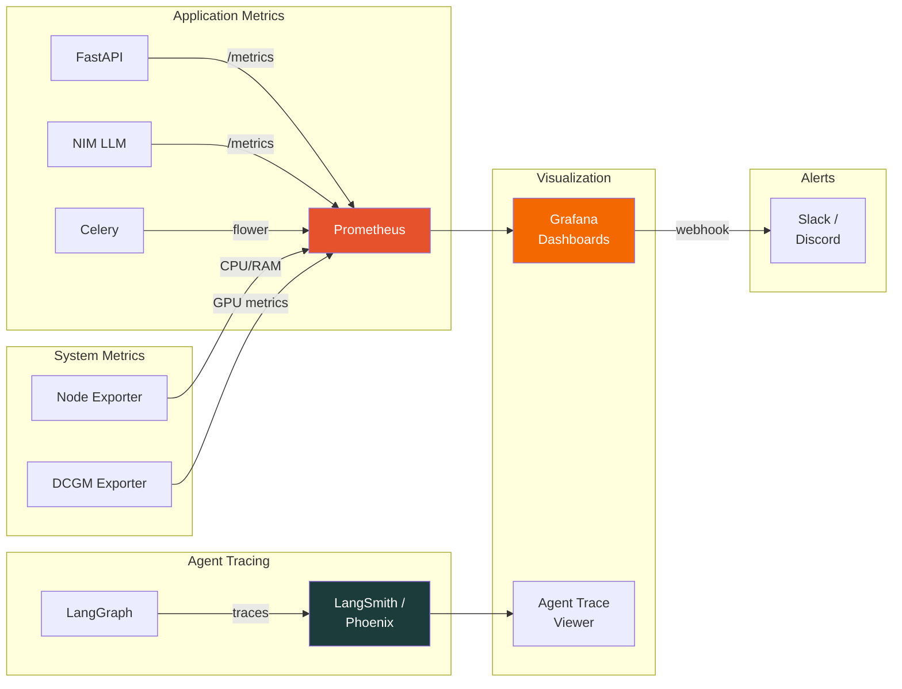

### What We Monitor

| Layer | Metric | Tool | Alert Threshold |
|-------|--------|------|-----------------|
| **GPU** | VRAM usage, GPU util %, temperature | DCGM Exporter + Grafana | VRAM > 90%, Temp > 80°C |
| **LLM** | Tokens/sec, latency p50/p95, queue depth | NIM metrics + Prometheus | p95 > 5s, queue > 10 |
| **Agents** | Agent execution time, success rate, tool calls | LangSmith / Phoenix | Success < 95%, time > 10s |
| **RAG** | Retrieval latency, relevance score, cache hit rate | Custom metrics | Relevance < 0.7 |
| **API** | Request rate, error rate, response time | FastAPI middleware | Error > 5%, p95 > 3s |
| **Weather** | Forecast freshness, Earth-2 inference time | Custom cron check | Stale > 1hr |
| **System** | CPU, RAM, disk, network | Node Exporter | RAM > 85%, disk > 80% |

### Grafana Dashboard Panels

| Panel | Visualization | Description |
|-------|--------------|-------------|
| GPU Overview | Gauge × 8 | Real-time VRAM/util for each H200 |
| LLM Throughput | Time series | Tokens/sec over time |
| Agent Pipeline | Heatmap | Latency per agent per request |
| Request Flow | Sankey diagram | User → Agent → Response flow |
| Error Rate | Single stat + sparkline | Rolling 5-min error percentage |
| Weather Freshness | Traffic light | Green/Yellow/Red forecast age |

### Agent Tracing (LangSmith)

Every request generates a full trace showing:

```
📝 Trace: "2-day Da Nang trip for couple"
├── 🎯 Orchestrator (1.2s)
│   ├── parse_intent: {days: 2, type: couple, interests: [beach, food]}
│   └── plan: [weather, attractions, local, route]
├── 🌦️ Weather Agent (0.8s)
│   ├── tool: get_forecast_15d → 200 OK
│   └── tool: assess_suitability → {beach: 9, hiking: 7}
├── 🏖️ Attraction Agent (1.5s)
│   ├── tool: search_attractions → 15 results
│   ├── tool: filter_by_weather → 8 results
│   └── tool: get_reviews → top 5 enriched
├── 🍜 Local Expert (0.9s)
│   └── tool: get_local_tips → 6 tips
├── 🗺️ Route Agent (1.1s)
│   ├── tool: cuopt_optimize → solved in 0.3s
│   └── tool: get_travel_times → 8 segments
└── 📝 Synthesize (2.1s)
    └── LLM call: Nemotron-3 → 847 tokens generated
Total: 4.8s | Tokens: 3,241 in / 847 out | Cost: $0.00 (self-hosted)
```

---

## 📅 6-Day Plan

### Team Roles

| Member | Role | Primary Focus |
|--------|------|---------------|
| **Member A** | Backend Lead | FastAPI, LangGraph orchestration, agent integration |
| **Member B** | AI/ML Engineer | Earth-2, cuOpt, NIM setup, model serving |
| **Member C** | Data & RAG Engineer | Data ingestion, Milvus, embeddings, retrieval |
| **Member D** | Frontend & DevOps | Gradio MVP → Next.js PWA, Docker, monitoring |

### Day-by-Day Gantt Chart

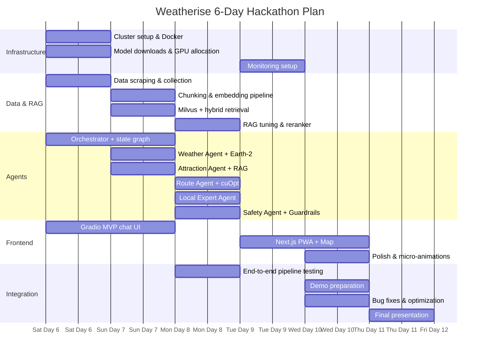

### Detailed Daily Plan

#### Day 1 (Jun 6) — Foundation 🏗️

| Time | Member A (Backend) | Member B (AI/ML) | Member C (Data/RAG) | Member D (Frontend/DevOps) |
|------|-------------------|-------------------|---------------------|---------------------------|
| AM | FastAPI boilerplate, WebSocket setup | SSH into cluster, Docker setup, GPU test | Scrape TripAdvisor, Wikivoyage, blogs | Docker Compose skeleton, Nginx config |
| PM | LangGraph StateGraph, AgentState design | Download & serve LLM via NIM | Da Nang Open Data API ingestion | Gradio ChatInterface MVP |
| EOD | ✅ API running, graph skeleton | ✅ LLM responding on GPU 0-1 | ✅ Raw data collected (~3k docs) | ✅ Gradio chat talks to API |

#### Day 2 (Jun 7) — Core Agents 🤖

| Time | Member A | Member B | Member C | Member D |
|------|----------|----------|----------|----------|
| AM | Orchestrator intent parser + routing | Earth-2 Studio setup on GPU 2-3 | Chunking pipeline + NV-Embed-v2 | Gradio → map integration (Folium) |
| PM | Weather Agent + Attraction Agent nodes | cuOpt deployment on GPU 6-7 | Milvus setup + document insertion | Weather card component |
| EOD | ✅ 2 agents in graph | ✅ Earth-2 + cuOpt running | ✅ Vector DB loaded, search works | ✅ Chat + weather cards |

#### Day 3 (Jun 8) — Full Pipeline 🔗

| Time | Member A | Member B | Member C | Member D |
|------|----------|----------|----------|----------|
| AM | Route Agent (cuOpt integration) | Embedding server + Reranker on GPU 4-5 | Hybrid retrieval (vector + BM25 + RRF) | Itinerary timeline component |
| PM | Local Expert Agent + Safety Agent | NeMo Guardrails setup | RAG evaluation & tuning | End-to-end demo flow test |
| EOD | ✅ All 5 agents working | ✅ All GPU services stable | ✅ RAG accuracy > 80% | ✅ MVP demo-ready |

> **🎯 MVP CHECKPOINT** — System should produce a complete travel plan from natural language query.

#### Day 4 (Jun 9) — Polish Frontend 🎨

| Time | Member A | Member B | Member C | Member D |
|------|----------|----------|----------|----------|
| AM | Response streaming (SSE/WebSocket) | Performance optimization, batch inference | Add more Da Nang data, food focus | Next.js PWA scaffolding |
| PM | Error handling, retry logic | Latency profiling, model quantization | Cache layer (Redis for weather) | Leaflet map + route visualization |
| EOD | ✅ Streaming responses | ✅ p95 < 5s latency | ✅ Redis cache, richer data | ✅ Next.js with map working |

#### Day 5 (Jun 10) — Optimize & Demo Prep 🚀

| Time | Member A | Member B | Member C | Member D |
|------|----------|----------|----------|----------|
| AM | Edge case handling, Vietnamese support | Prometheus + Grafana dashboards | Final RAG tuning, add reviews | Mobile responsive, animations |
| PM | Demo script preparation | GPU monitoring dashboard | Prepare demo queries & screenshots | Record demo video, screenshots |
| EOD | ✅ Robust system | ✅ Monitoring live | ✅ Data polished | ✅ Demo-ready PWA |

#### Day 6 (Jun 11) — Presentation 🎤

| Time | All Members |
|------|-------------|
| AM | Final integration test, practice presentation, prepare backup plan |
| PM | **Present to judges** — live demo + slides + Q&A |

### Risk Mitigation

| Risk | Probability | Mitigation |
|------|-------------|------------|
| Earth-2 setup fails | Medium | Fallback: OpenWeatherMap API only |
| cuOpt license issue | Low | Fallback: Valhalla + greedy optimizer |
| LLM too slow | Medium | Switch to Llama 3.1 8B or quantized model |
| Milvus OOM | Low | Use Milvus Lite (SQLite backend) |
| Next.js not ready | Medium | Ship with Gradio UI (still impressive) |
| Data quality poor | Medium | Curate manually top 50 attractions |

---

## 🔮 Future Reuse & Enterprise Value

### Domain-Agnostic Architecture

The core Weatherise MAS architecture is designed to be **plug-and-play across domains**. The framework consists of 3 reusable layers:

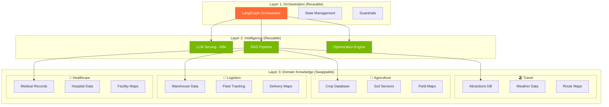

### Reuse Examples

| Domain | Weather Agent Becomes | Attraction Agent Becomes | Route Agent Becomes |
|--------|----------------------|-------------------------|---------------------|
| 🌾 **Agriculture** | Crop weather advisor (frost, rain, irrigation) | Crop recommendation engine | Equipment routing optimizer |
| 🚚 **Logistics** | Weather-aware delivery planner | Warehouse inventory advisor | Fleet route optimizer (cuOpt) |
| 🏗️ **Construction** | Weather safety checker (wind, rain, heat) | Material recommendation | Equipment scheduling |
| 🏥 **Healthcare** | Air quality + pollen advisor | Facility recommendation | Ambulance route optimizer |
| 🎓 **Education** | School weather advisory | Course recommendation | School bus route optimizer |

### Why Enterprises Need This NOW

#### 1. The AI Agent Market is Exploding

> **"By 2028, 33% of enterprise software applications will include agentic AI, up from less than 1% in 2024."**
> — Gartner, October 2025

> **"The global AI agent market is projected to reach $47.4 billion by 2030, growing at a CAGR of 45.8%."**
> — MarketsandMarkets Research, 2025

#### 2. Weather-Driven Economic Impact

> **"Weather-related disruptions cost the global tourism industry $142 billion annually."**
> — World Travel & Tourism Council (WTTC), 2024

> **"68% of travelers have changed plans due to unexpected weather, resulting in $18B in lost bookings."**
> — Booking.com Travel Confidence Report, 2025

> **"Climate volatility increased extreme weather events by 40% in Southeast Asia between 2020-2025."**
> — UN ESCAP Climate Report, 2025

#### 3. Vietnam's Digital Tourism Push

> **"Da Nang welcomed 17.3 million visitors in 2025 (+15% YoY) with VND 60 trillion in tourism revenue."**
> — Vietnam National Administration of Tourism, 2025

> **"Da Nang was named Vietnam's Smart City for the 6th consecutive year in 2025."**
> — Vietnam ICT Award, 2025

> **"Vietnam's tourism sector targets $35 billion in revenue by 2030, requiring AI-driven personalization."**
> — Vietnam Ministry of Culture, Sports and Tourism, 2024

#### 4. NVIDIA's Enterprise AI Push

> **"NVIDIA launched the Multi-Agent Intelligent Warehouse blueprint at GTC 2026, validating multi-agent systems for enterprise operations."**
> — NVIDIA GTC 2026

> **"NeMo Agent Toolkit now supports framework-agnostic orchestration across LangChain, CrewAI, and Microsoft Semantic Kernel."**
> — NVIDIA Developer Blog, 2025

> **"NVIDIA cuOpt solves routing problems 120x faster than traditional CPU methods, won the 2025 COIN-OR Cup."**
> — COIN-OR Foundation, 2025

#### 5. Agricultural Reuse — A Critical Need

> **"The AI in agriculture market reached $4.7 billion in 2025, driven by climate uncertainty and labor shortages."**
> — Allied Market Research, 2025

> **"EU Green Deal mandates 50% reduction in pesticide use by 2030, requiring AI-driven precision farming."**
> — European Commission, 2024

> **"Multi-agent systems in agriculture reduce water usage by 30% and increase yield by 15-25% through weather-optimized scheduling."**
> — Nature Food Journal, 2024

### Competitive Advantages

| Feature | Weatherise | Traditional Travel Apps | Generic Chatbots |
|---------|-----------|------------------------|-------------------|
| Weather-aware planning | ✅ Earth-2 AI forecasts | ❌ Static weather widget | ❌ No weather integration |
| GPU-optimized routing | ✅ cuOpt (120x faster) | ❌ Basic directions | ❌ No routing |
| Multi-agent reasoning | ✅ 7 specialized agents | ❌ Monolithic logic | ⚠️ Single LLM call |
| Local knowledge (RAG) | ✅ 3,000+ curated docs | ⚠️ Generic reviews | ❌ Hallucinations |
| **Real-time re-planning** | ✅ StormScope nowcast → SMS alert → auto re-plan | ❌ Manual checking | ❌ No adaptation |
| **Plan export + QR** | ✅ Beautiful image + QR code | ❌ Screenshot only | ❌ Text only |
| Domain reusable | ✅ Plug-and-play layers | ❌ Travel-only | ❌ No structure |
| Self-hosted (privacy) | ✅ On-premise 8×H200 cluster | ❌ Cloud-dependent | ❌ API-dependent |
| Cost per query | ✅ $0.00 (self-hosted) | N/A | 💰 $0.03-0.10/query |

### Persuasion Points for Judges

1. **Real Problem, Real Data** — Da Nang has 19.5M visitors/year but NO intelligent weather-aware travel planner
2. **Full NVIDIA Stack** — Earth-2 + StormScope + cuOpt + NIM + NeMo = maximum utilization of 8×H200 cluster
3. **Not Just a Chatbot** — 7 specialized agents (including 2 real-time background agents) with GPU-accelerated optimization
4. **Truly Real-Time** — Earth-2 StormScope runs nowcasting every 10 min on GPU → proactive SMS alerts 30 min before weather affects outdoor plans
5. **Reusable Framework** — Same architecture serves agriculture, logistics, healthcare — proven by NVIDIA's own warehouse blueprint
6. **Production-Ready** — Docker Compose deployment, Prometheus monitoring, NeMo Guardrails safety
7. **Plan Export** — Beautiful itinerary image + QR code for offline access — shareable on social media
8. **Cost Efficiency** — Self-hosted = $0/query vs. $0.03-0.10 on cloud APIs. SMS alerts at ~350 VND/msg
9. **Vietnamese Market** — Bilingual (EN/VI), local knowledge, Vietnamese SMS support, culturally-aware recommendations
10. **Measurable Impact** — Reduces trip planning from hours to seconds, prevents weather-ruined experiences proactively

---

## 📜 License

MIT License — See [LICENSE](./LICENSE) for details.

---

## 👥 Team Weatherise

Built with ❤️ and ☀️ for Da Nang City.

| Member | Role |
|--------|------|
| Member A | Backend Lead |
| Member B | AI/ML Engineer |
| Member C | Data & RAG Engineer |
| Member D | Frontend & DevOps |

---

> **"The best weather is the weather you planned for."** — Weatherise, 2026
