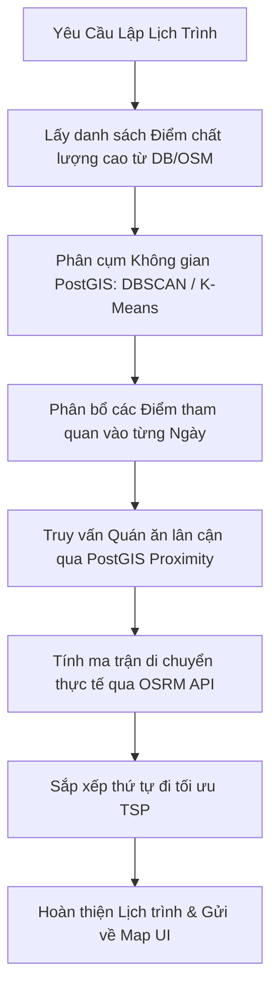

# 🔍 Nghiên Cứu Giải Pháp Làm Giàu Dữ Liệu Điểm Tham Quan & Tối Ưu Hóa Lịch Trình — Đà Nẵng

Tài liệu này trình bày kết quả nghiên cứu chuyên sâu về các phương án mở rộng dữ liệu địa điểm du lịch (Sightseeing & Attractions) tại Đà Nẵng sang mức độ bao phủ toàn diện (Maximum Density), cùng với các thuật toán tối ưu hóa vị trí (Spatial Clustering) nhằm đảm bảo lịch trình du lịch được thiết kế khoa học, các điểm tham quan/quán ăn trong ngày nằm gần nhau và có chất lượng dịch vụ tốt nhất.

---

## 1. Phân Tích Thực Trạng Dữ Liệu Địa Điểm Hiện Tại

* **Dữ liệu Ăn uống (Restaurants)**: Đã đạt độ dày rất tốt với **1.990 quán** có sẵn trong PostgreSQL (phân loại chi tiết từ quán ăn bình dân, quán nhậu, cafe đến nhà hàng cao cấp).
* **Dữ liệu Điểm tham quan (Attractions)**: Chỉ có **36 điểm** được lưu cứng ở cơ sở dữ liệu gốc. Mặc dù hệ thống có cơ chế tự động gọi **OpenStreetMap (OSM) Overpass API** để tải trực tiếp các điểm xung quanh khi có yêu cầu, dữ liệu từ OSM có một số hạn chế lớn:
  * Thiếu phần mô tả chi tiết (description/highlights) để phục vụ mô hình ngôn ngữ (RAG).
  * Thiếu xếp hạng chất lượng (rating/reviews) từ người dùng thực tế.
  * Thiếu thông tin mức giá (price tier) và giờ mở cửa chính xác của các địa điểm nhỏ lẻ.

---

## 2. Đề Xuất Các Giải Pháp Tăng Cường Độ Dày Dữ Liệu (Data Enrichment Options)

Để đảm bảo du khách muốn đi đâu, làm gì hệ thống cũng sẵn sàng đưa ra các lựa chọn chất lượng và mới nhất, chúng ta đề xuất các phương án sau cho MCP và Database:

### 2.1. Phương Án 1: Nâng cấp OpenStreetMap kết hợp Wikipedia & Wikidata API (Giải pháp 100% Free & Dynamic)
* **Cách hoạt động**:
  1. Khi người dùng yêu cầu một khu vực hoặc loại hình du lịch, **Tourism Context Agent** sẽ gọi Overpass API với bộ lọc tag mở rộng tối đa:
     * `tourism=attraction|museum|viewpoint|theme_park|artwork|gallery|zoo` (Điểm tham quan)
     * `historic=monument|castle|ruins|heritage|battlefield` (Điểm lịch sử)
     * `natural=beach|peak|cave_entrance|waterfall` (Địa hình tự nhiên, bãi biển, thác nước, hang động)
     * `leisure=park|garden|nature_reserve|water_park|playground` (Khu vui chơi, công viên, khu bảo tồn)
     * `amenity=marketplace|place_of_worship|arts_centre|theatre` (Chợ truyền thống, chùa/nhà thờ, nhà hát)
  2. Với mỗi địa điểm lấy được, hệ thống tự động gọi **Wikipedia Geosearch API** trong bán kính 1km:
     `https://vi.wikipedia.org/w/api.php?action=query&list=geosearch&gsradius=1000&gscoord={latitude}|{longitude}&format=json`
  3. Lấy bài viết Wikipedia tương ứng và gọi API trích xuất nội dung giới thiệu (abstract) làm dữ liệu thuyết minh địa danh lưu vào Postgres/Qdrant.
* **Ưu điểm**: Hoàn toàn miễn phí, tự động tải dữ liệu cho bất kỳ thành phố nào trên thế giới, thông tin thuyết minh chính thống.
* **Nhược điểm**: Thiếu điểm đánh giá (rating) và giá vé của các điểm thương mại tư nhân.

### 2.2. Phương Án 2: Tích hợp MCP Google Places API & Apify Maps Scraper (Giải pháp Chất lượng cao nhất)
* **Cách hoạt động**:
  1. Xây dựng một MCP tool kết nối với **Google Places API** hoặc chạy một script Python ngầm định kỳ sử dụng **Apify Google Maps Scraper** (hoặc Playwright/Selenium tự viết) để cào dữ liệu địa điểm tại Đà Nẵng theo các từ khóa tiếng Việt & Anh: `"địa điểm du lịch Đà Nẵng"`, `"chỗ chơi Đà Nẵng"`, `"bãi biển đẹp Đà Nẵng"`, `"viewpoint Da Nang"`, `"quán cafe checkin Đà Nẵng"`.
  2. Thu thập đầy đủ các trường thông tin:
     * `place_id` (Google), `name`, `formatted_address`, `latitude`, `longitude`
     * `rating` (Ví dụ: 4.5), `user_ratings_total` (Số lượt đánh giá)
     * `editorial_summary` (Đoạn mô tả ngắn gọn do Google tổng hợp)
     * `photos` (URL ảnh đại diện chất lượng cao)
     * `price_level` (Mức giá: rẻ, trung bình, sang trọng)
     * `opening_hours` (Giờ mở cửa chi tiết cho từng ngày trong tuần)
     * `popular_times` (Biểu đồ lượng khách theo từng giờ để tránh đi vào giờ đông đúc)
  3. Tiến hành đồng bộ (ingest) dữ liệu này vào PostgreSQL và Vector DB (Qdrant).
* **Ưu điểm**: Dữ liệu cực kỳ dày và luôn mới nhất (Google Maps cập nhật nhanh nhất các quán cafe, bãi tắm mới nổi). Điểm đánh giá (rating) giúp thuật toán ưu tiên chọn điểm chất lượng cao.
* **Nhược điểm**: Google Places API chính thức có phí. Giải pháp cào dữ liệu (scraping) cần bảo trì khi Google thay đổi giao diện HTML.

### 2.3. Phương Án 3: Xây dựng CSDL Tĩnh từ Tripadvisor & Traveloka Xperience (Giải pháp Tối ưu Chi phí & Khai thác Tour)
* **Cách hoạt động**:
  1. Crawl danh sách Top 150 điểm tham quan hàng đầu Đà Nẵng trên **Tripadvisor**.
  2. Crawl danh mục Vé tham quan, Tour du lịch, và hoạt động trải nghiệm trên **Traveloka Xperience** hoặc **Klook** tại Đà Nẵng (ví dụ: vé cáp treo Bà Nà, vé tắm khoáng nóng Núi Thần Tài, tour lặn ngắm san hô Cù Lao Chàm, du thuyền Sông Hàn...).
  3. Nhập dữ liệu này làm Seed Data vào hệ thống.
* **Ưu điểm**: Dữ liệu cực kỳ phù hợp cho du lịch trải nghiệm thực tế, có kèm thông tin giá vé và link đặt chỗ tiện lợi.
* **Nhược điểm**: Là dữ liệu tĩnh, cần chạy cập nhật định kỳ (ví dụ: 3 tháng một lần).

---

## 3. Giải Pháp Thiết Kế Kế Hoạch Lộ Trình Gần Nhau & Chất Lượng (Spatial Routing)

Để giải quyết bài toán: **"Lên kế hoạch sao cho các địa điểm đi trong ngày ở gần nhau và đề xuất được quán ăn chất lượng ở ngay bên cạnh"**, chúng ta áp dụng mô hình toán học và không gian sau vào Database & API:



### 3.1. Phân cụm Địa lý tự động (Spatial Clustering) bằng PostGIS
Thay vì chọn điểm ngẫu nhiên, hệ thống sẽ sử dụng thuật toán phân cụm không gian **K-Means** tích hợp sẵn trong PostGIS để chia các địa điểm tham quan được chọn thành các nhóm tương ứng với số ngày đi ($K$ ngày):
```sql
SELECT 
    id, name_vi, latitude, longitude,
    ST_ClusterKMeans(coordinate, 3) OVER () AS day_cluster
FROM locations
WHERE category = 'attraction'
AND (vibe_tags && $1 OR $1 IS NULL);
```
* **Kết quả**: Hệ thống tự động gom nhóm địa lý chuẩn xác:
  * **Cụm 0 (Sơn Trà - Mỹ Khê)**: Chùa Linh Ứng, Bãi tắm Mỹ Khê, Đỉnh Bàn Cờ, các quán hải sản dọc đường Võ Nguyên Giáp.
  * **Cụm 1 (Trung tâm Thành phố)**: Cầu Rồng, Chợ Hàn, Nhà thờ Con Gà, Bảo tàng Chăm, các quán cafe trung tâm Hải Châu.
  * **Cụm 2 (Phía Nam & Ngoại ô)**: Ngũ Hành Sơn, Phố cổ Hội An, KDL Rừng dừa Bảy Mẫu.

### 3.2. Sắp xếp Thứ tự Di chuyển Tối ưu (TSP - Traveling Salesperson Problem)
* Sử dụng **OSRM API** (Open Source Routing Machine) để lấy ma trận khoảng cách và thời gian di chuyển bằng đường bộ thực tế (chứ không dùng đường chim bay):
  `http://router.project-osrm.org/table/v1/driving/{lon1},{lat1};{lon2},{lat2};...`
* Sắp xếp thứ tự các điểm trong ngày để tổng thời gian di chuyển là ngắn nhất, tránh tình trạng di chuyển đan chéo gây mệt mỏi cho du khách.

### 3.3. Thuật toán Ghép Quán ăn Chất lượng lân cận (Proximity Dining Recommendation)
Để mỗi điểm dừng chân đều có quán ăn/uống chất lượng tốt sát bên, khi lập lịch trình cho khung giờ `lunch` hoặc `dinner`, Context Agent sẽ thực hiện truy vấn Postgres tìm kiếm quán ăn xung quanh toạ độ của điểm tham quan vừa kết thúc:
```sql
SELECT id, name_vi, address, latitude, longitude, avg_rating,
       ST_Distance(coordinate, ST_SetSRID(ST_MakePoint($1, $2), 4326)::geography) AS dist_m
FROM locations
WHERE category = 'restaurant'
AND is_opening = true
AND avg_rating >= 4.0 -- Chỉ chọn quán chất lượng cao
ORDER BY dist_m ASC
LIMIT 5;
```
* **Cách ghép**: Nếu buổi chiều du khách tham quan **Bảo tàng Chăm** (Kinh độ: $108.222$, Vĩ độ: $16.061$), hệ thống sẽ tự động quét bán kính 500m xung quanh bảo tàng để lấy các quán ăn ngon nhất, đi bộ được (như Mỳ Quảng ếch bếp Trang, Bánh xèo Bà Dưỡng...) xếp vào khung giờ ăn tối ngay sau đó.

---

## 4. Kế Hoạch Triển Khai Chi Tiết (Implementation Roadmap)

| Giai Đoạn | Công Việc | Công Cụ | Mục Tiêu |
| :--- | :--- | :--- | :--- |
| **Giai đoạn 1** | Viết script cào dữ liệu Google Maps | Apify / Python BeautifulSoup | Thu thập 150 điểm tham quan & 300 quán cafe/check-in hot nhất Đà Nẵng kèm Rating, Reviews, hình ảnh. |
| **Giai đoạn 2** | Nâng cấp API Overpass trong mã nguồn | Python Httpx & Wikipedia API | Mở rộng tag tìm kiếm của Overpass và tự động kéo nội dung mô tả từ Wikipedia khi có điểm mới. |
| **Giai đoạn 3** | Tối ưu hóa Database | PostgreSQL (PostGIS) | Áp dụng hàm `ST_DWithin` và `ST_Distance` để tìm kiếm quán ăn lân cận thực tế, thay thế hoàn toàn cho danh sách mock tĩnh. |
| **Giai đoạn 4** | Tích hợp OSRM Routing | OSRM Table API | Sắp xếp thứ tự lộ trình di chuyển theo đường bộ thực tế tối ưu thời gian. |
