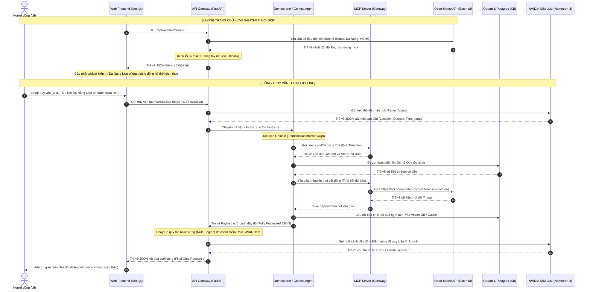

# 🔄 Luồng Dữ Liệu & Nguồn Dữ Liệu (Data Flow & Data Sources) — Weatherise v2

Tài liệu này làm rõ chi tiết các **nguồn dữ liệu** mà hệ thống **Weatherise** đang kết nối, cách dữ liệu được luân chuyển (Data Flow) qua các thành phần, và các cơ chế cache/lấy dữ liệu thời gian thực.

---

## 1. Bản Đồ Nguồn Dữ Liệu (Data Sources Map)

Hệ thống Weatherise tổng hợp thông tin từ nhiều nguồn dữ liệu tĩnh, động và mô hình AI để phục vụ việc phân tích rủi ro:

| Loại dữ liệu | Nguồn cung cấp (Source) | Phương thức lấy (Method) | Vai trò trong hệ thống (Purpose) |
| :--- | :--- | :--- | :--- |
| **Dự báo thời tiết** | **Open-Meteo API** (Free) | REST API HTTPS (`api.open-meteo.com`) | Cung cấp dữ liệu dự báo chi tiết theo giờ (nhiệt độ, mưa, gió, độ ẩm, mã thời tiết) trong 7 ngày tới. |
| **Thời tiết thực tế** | **Open-Meteo API** | Gọi trực tiếp từ FastAPI hoặc Web UI qua client | Hiển thị nhiệt độ, tốc độ gió, độ ẩm và lượng mưa trực tiếp ngoài Trang chủ cho Đà Nẵng, Hà Nội, TP.HCM. |
| **Tọa độ địa lý** | **MCP Location Tool** | Kết nối qua cổng MCP Server (`resolveCoordinates`) | Dịch tên địa điểm người dùng nhập (ví dụ: *"Sa Pa"*, *"Đà Nẵng"*) thành tọa độ `latitude` và `longitude`. |
| **Tìm kiếm Địa điểm** | **MCP Place Tool** | Gọi API tìm kiếm địa điểm | Tìm kiếm tọa độ và chi tiết của các địa điểm du lịch, công trình hoặc trang trại trong khu vực. |
| **Khoảng thời gian** | **MCP Time Tool** | Logic xử lý thời gian thực | Chuyển đổi các từ ngữ thời gian tự nhiên (ví dụ: *"tuần tới"*, *"thứ 7 này"*) thành khoảng ngày tháng cụ thể (`start_date`, `end_date`). |
| **Quy tắc rủi ro miền** | **PostgreSQL Database** | Truy vấn SQL qua SQLAlchemy | Lưu trữ các ngưỡng giới hạn rủi ro vật lý (ví dụ: nhiệt độ bao nhiêu là quá nóng cho đổ bê tông, lượng mưa bao nhiêu là nguy hiểm cho du lịch). |
| **Tri thức lưu trữ (KB)** | **Qdrant (Vector DB)** | Tìm kiếm tương tự (Vector Similarity Search) | Lưu trữ các dữ liệu lịch sử thời tiết và kết quả phân tích RAG để làm giàu ngữ cảnh cho Agent. |
| **Caching & Session** | **Redis Cache** | Đọc/Ghi Key-Value tốc độ cao | Lưu trữ tạm thời kết quả thời tiết của các thành phố để giảm tải số lần gọi API ngoài và lưu trữ session WebSocket. |

---

## 2. Sơ Đồ Luồng Dữ Liệu Tổng Thể (Overall Data Flow Diagram)

Dưới đây là sơ đồ chi tiết biểu diễn hành trình của dữ liệu từ yêu cầu ban đầu cho đến phản hồi kết quả:

---

## 3. Luồng Xử Lý Chi Tiết (Runtime Execution Stages)

### Giai đoạn 1: Phân tích Cú pháp (Parsing Stage)
Khi người dùng nhập yêu cầu, hệ sinh thái AI sử dụng mô hình **NVIDIA NIM (Nemotron-3 Super 120B)** đóng vai trò Parser. Đầu ra của Parser là một tài liệu JSON được chuẩn hóa, giúp hệ thống biết chính xác:
* **Địa điểm cần phân tích** (`location`)
* **Thời gian cần dự báo** (`time_range`)
* **Lĩnh vực cần đánh giá** (`domain`)

### Giai đoạn 2: Định tuyến & Làm giàu Ngữ cảnh (Routing & Enrichment)
**Orchestrator** chuyển tiếp payload đến Agent chuyên môn. Agent này sẽ gọi các công cụ MCP:
1. Gửi tên địa điểm đến **MCP Location** để chuyển hóa thành Lat/Lon.
2. Gửi thời gian đến **MCP Time** để dịch thành các ngày cụ thể.
3. Sử dụng Lat/Lon và các ngày để gọi API **Open-Meteo** lấy thông tin dự báo thời tiết chi tiết theo giờ (Nhiệt độ, Gió, Mưa, Độ ẩm, Mã thời tiết).

### Giai đoạn 3: Đánh giá Rủi ro và Lập luận (Risk Assessment & Reasoning)
Sau khi thu thập đầy đủ dữ liệu, hệ thống đưa vào **Intelligence Layer**:
* **Rule Engine (Chấm điểm quy tắc cứng):** Chạy kiểm tra các ngưỡng vật lý để đánh giá mức độ rủi ro (RAIN, WIND, HEAT) thành các mức `LOW`, `MEDIUM`, hoặc `HIGH`.
* **NIM LLM Reasoning:** Đưa toàn bộ điểm số rủi ro cứng kèm thông số thời tiết và tri thức miền đã làm giàu vào LLM để tạo ra lời khuyên, đề xuất hành động thực tiễn bằng ngôn ngữ tự nhiên.

### Giai đoạn 4: Hiển thị Trực quan (Frontend Presentation)
Dữ liệu cuối cùng được gửi về Next.js Frontend để render ra thẻ kết quả chia đôi màn hình độc đáo, giúp người dùng nắm bắt thông tin nhanh chóng.
