# 📊 Data Flow and Database Density Analysis — Weatherise v2

This document provides a detailed diagnosis of the current database inventory, the updated system data flow, and an evaluation of the system's ability to plan itineraries (sightseeing, restaurants, beaches) based on user preferences and constraints.

---

## 1. Database Inventory & Data Analysis

An audit of the PostgreSQL database (`weatherise` database, `locations` table) reveals a total of **2,026 locations** currently indexed.

### 1.1. Category Distribution
The database contains two main categories of locations:

| Category | Count | Description / Source |
| :--- | :--- | :--- |
| **`restaurant`** | 1,990 | Full dining dataset containing cafes, local eateries, dessert shops, and seafood bars. Originally seeded from Foody. |
| **`attraction`** | 36 | Key sightseeing spots in Da Nang (Ba Na Hills, Linh Ung Pagoda, Cham Museum, Han Market, etc.). |

### 1.2. Restaurant Subcategory Distribution
The dining data is highly diverse and covers a wide range of tastes, which provides excellent support for preference matching:

* **Quán ăn (Local Diners)**: 970 locations
* **Ăn vặt / Vỉa hè (Street Food)**: 320 locations
* **Café / Dessert**: 220 locations
* **Nhà hàng (Fine Dining)**: 148 locations
* **Quán nhậu (Local Pubs)**: 57 locations
* **Ăn chay (Vegetarian)**: 17 locations
* **Buffet**: 7 locations
* **Bar/Pub / Beer Club**: 7 locations

### 1.3. Attraction Subcategory Distribution
Pre-seeded local attractions in the database:
* **Place of Worship (Chùa, Nhà thờ)**: 16 locations
* **Museum (Bảo tàng)**: 4 locations
* **Artwork**: 3 locations
* **Park / Viewpoint**: 3 locations
* **Attraction (General)**: 9 locations

---

## 2. Dynamic Data Flow Architecture

The following diagram illustrates how raw user input transitions through the system, fetching both static database items and dynamic live data before compiling the final itinerary.

```mermaid
sequenceDiagram
    autonumber
    actor User as User/Frontend
    participant API as FastAPI Backend
    participant Parser as Parser Agent (Qwen-3.5)
    participant Orch as Orchestrator
    participant Agent as Tourism Context Agent
    participant DB as Postgres & Qdrant KB
    participant OSM as OSM Overpass API (Live)
    participant Weather as Open-Meteo MCP
    participant Intel as Intelligence Layer (NIM)

    User->>API: raw_user_input ("Plan a 3-day trip...")
    API->>Parser: Extract intent, location, time, preferences
    Parser-->>API: ParserOutput (domain: tourism, preferences: ["seafood"])
    API->>Orch: Route ParserOutput
    Orch->>Agent: process()
    
    rect rgb(20, 30, 45)
        note right of Agent: Step 1: Gather Context
        Agent->>Weather: Get weather forecast for coordinates & dates
        Weather-->>Agent: weather_forecast (temperatures, rain probability)
        Agent->>DB: Query cached attractions & restaurants (Qdrant/Postgres)
        alt KB Miss (No locations in cache)
            Agent->>OSM: Fetch live attractions (Overpass live fetch)
            OSM-->>Agent: live POIs (lat/lon, name, categories)
            Agent->>DB: Async Ingest live POIs into Postgres & Qdrant
        end
    end

    rect rgb(25, 40, 30)
        note right of Agent: Step 2: Heuristic Planning & Weather Rules
        Agent->>Agent: Proximity Clustering (Haversine distance <= 15km)
        Agent->>Agent: Interleave top nearest restaurants to day's attractions
        Agent->>Agent: Apply Weather Rules (If rain >= 60%, sort indoor stops first)
        Agent->>Agent: Attach indoor backup options
    end

    Agent-->>API: FullyProcessedPayload (Context + Itinerary)
    API->>Intel: reason(payload)
    Intel-->>API: Final Travel Advisory & Risk Scoring
    API-->>User: Render chat + Map UI (stops, backup warnings, leaflet pins)
```

---

## 3. Evaluation of Data Density & Planning Suitability

### 3.1. Strengths
1. **Dynamic Extension via OpenStreetMap (OSM)**: Although the pre-seeded attraction list is small (36 items), the **Overpass Live Fetcher** resolves this by executing live queries for any region. This guarantees that tourist spots (beaches, parks, viewpoints, museums) are dynamically downloaded, geolocated, and cached on-the-fly.
2. **Deep Dining Options**: With nearly 2,000 restaurant/cafe items, the system can choose highly relevant local places, avoid repetitive dining options, and cluster them near attractions.
3. **Weather-Resilient Planning**: Every location in the DB (and those fetched from OSM) has metadata indicating whether it is `is_indoor`, `rain_sensitive`, or `uv_sensitive`. This lets the `ContextAssembler` successfully reorganize the day (putting indoor activities first during rainy hours) and offer solid backup suggestions.

### 3.2. Current Gaps & Limitations
> [!WARNING]
> **1. Hardcoded Restaurant Mock Fallback**
> - In `TourismRetriever.get_restaurants()`, the code currently loads and returns restaurants from a static mock file (`danang_restaurants.json`) rather than querying the 1,990 restaurants stored in PostgreSQL.
> - PostgreSQL is only used if the MCP route `place.searchRestaurants` is called, but this route is not currently hooked into the agent's main planning loop.
>
> **2. Preferences Filtering Gap**
> - The Qwen Parser successfully extracts user preferences (e.g. `preferences: ["seafood", "cafe"]`), but these fields are **not yet passed** to the database or vector queries.
> - As a result, the `TourismRetriever` fetches a generic batch of 20 attractions and 15 restaurants. The final LLM reasoning layer must choose from this limited batch, meaning specific preferences might be missed if they weren't in the initial top-K generic fetch.

---

## 4. Recommendations for a Premium Experience

To enable true personalized travel planning according to user preferences, we should implement the following enhancements:

1. **Active Postgres Dining Query**: Update `TourismRetriever.get_restaurants` to call the `place.searchRestaurants` MCP route or query the database directly, making use of the 1,990 rich Foody rows.
2. **Preference-Aware Vector Retrieval**: Modify the retriever to incorporate `parsed.trip_request.preferences` in its queries, querying Qdrant with specific query strings (e.g. searching for "seafood restaurant" or "nature viewpoint" instead of the generic "tourist attractions").
3. **Advanced Clustering**: Calculate exact routing coordinates and travel times using the OSRM MCP route, replacing the simple Haversine distance heuristics.
