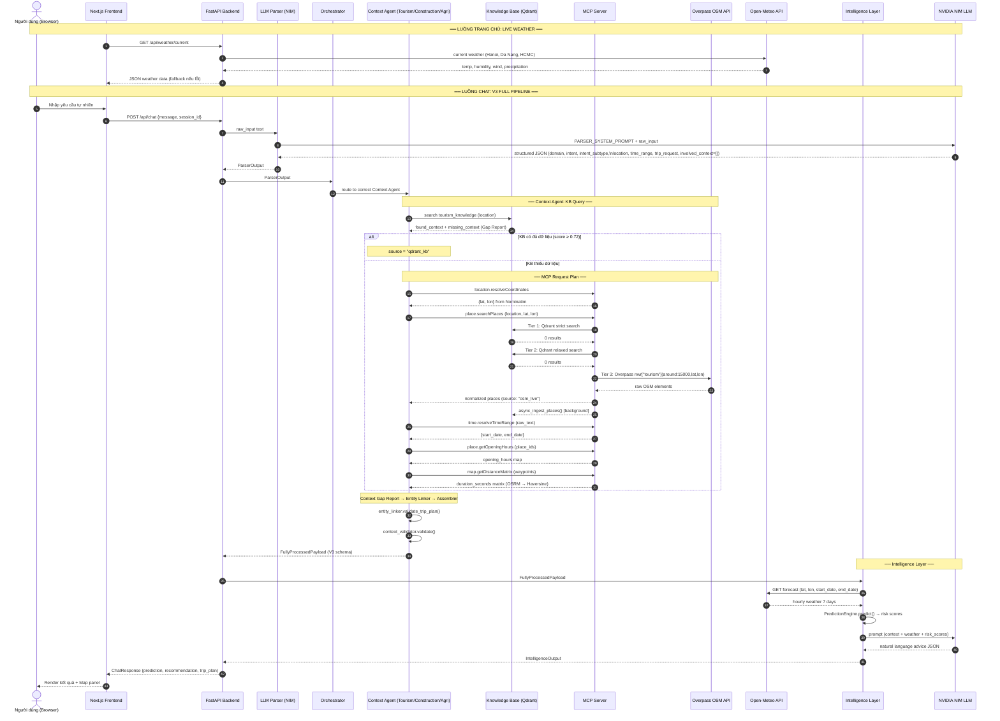
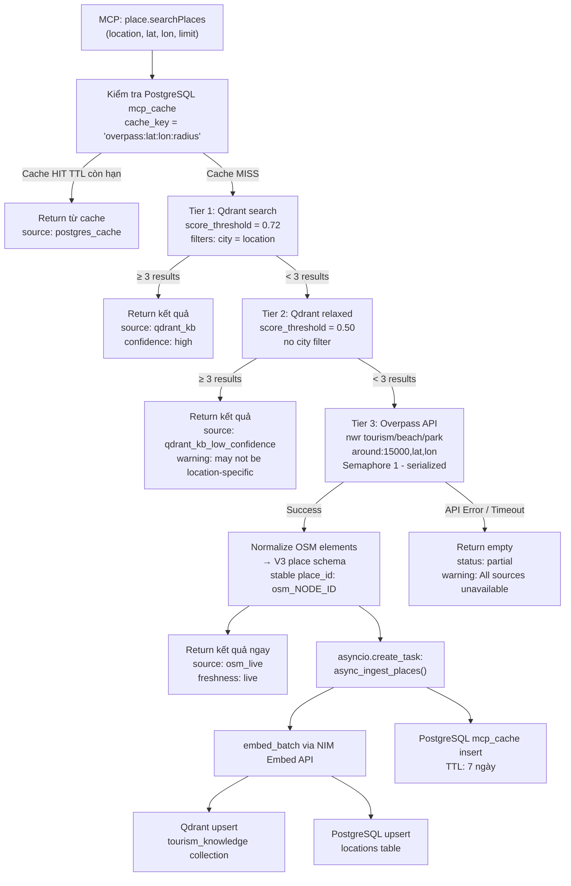

# 🔄 Luồng Dữ Liệu & Kiến Trúc Dữ Liệu — Weatherise V3

> **Phiên bản:** V3  
> **Cập nhật:** 2026-06-10  
> **Thay thế:** `data_flow.md` (V2)  
> **Thêm mới:** KB-Miss → Live Fetch → Async RAG Ingest pattern, Use Cases đầy đủ, Context Fusion Layer

---

## 1. Bản Đồ Nguồn Dữ Liệu V3

| Loại dữ liệu | Nguồn | Phương thức | Khi nào dùng |
| :--- | :--- | :--- | :--- |
| **Dự báo thời tiết** | Open-Meteo API (Free) | REST HTTPS | Intelligence Layer gọi trực tiếp — luôn luôn |
| **Thời tiết thực tế (UI)** | Open-Meteo API | GET `/api/weather/current` | Trang chủ — real-time widget |
| **Tọa độ địa lý** | Nominatim OSM (Free) | MCP `location.resolveCoordinates` | Mỗi request có location text |
| **Địa điểm du lịch** | **Qdrant KB** → **Overpass OSM Live** | 3-Tier: KB → Relaxed → Live | Context Agent cần tourist attractions |
| **Nhà hàng** | **PostgreSQL** (Foody data) → Mock fallback | PostGIS spatial query | Context Agent cần restaurants |
| **Giờ mở cửa** | PostgreSQL `locations.opening_hours` → OSM tags | MCP `place.getOpeningHours` | Trip planning |
| **Ma trận khoảng cách** | OSRM (self-hosted) → Haversine fallback | MCP `map.getDistanceMatrix` | Route planning |
| **Khoảng thời gian** | Logic nội bộ | MCP `time.resolveTimeRange` | Khi user dùng ngôn ngữ tự nhiên về thời gian |
| **Quy tắc rủi ro** | PostgreSQL + Qdrant KB | MCP `domain.getExternalRiskData` | Domain-specific thresholds |
| **Caching** | PostgreSQL `mcp_cache` + Redis | TTL key-value | Tránh gọi Overpass / Nominatim lặp lại |
| **Session** | Redis | WebSocket session | Multi-turn conversation |

---

## 2. Kiến Trúc 3-Tier Lấy Dữ Liệu Địa Điểm (KB-Miss Pattern)

Đây là cơ chế cốt lõi V3 đảm bảo MCP **luôn có real data** ngay cả khi Qdrant chưa có dữ liệu.

```
MCP route: place.searchPlaces(location, lat, lon)
│
├─ TIER 1 ─ Qdrant Vector Search (score ≥ 0.72, ≥3 kết quả)
│           → Kết quả: source = "qdrant_kb", confidence = "high"
│           → Trường hợp: Đà Nẵng (đã seed), các location quen thuộc
│
├─ TIER 2 ─ Qdrant Relaxed Search (score ≥ 0.50)
│           → Kết quả: source = "qdrant_kb_low_confidence", warning
│           → Trường hợp: Location gần giống, tên khác nhau nhỏ
│
└─ TIER 3 ─ LIVE FETCH: Overpass API (OpenStreetMap)
            Query: nwr["tourism"](around:15000,lat,lon)
            → Kết quả: source = "osm_live", real data thực tế
            → Trường hợp: Hội An, Nha Trang, bất kỳ location nào
            → Background: async_ingest_places() → Qdrant + Postgres
            → Cache: mcp_cache TTL 7 ngày → lần sau Tier 1 sẽ tìm thấy
```

---

## 3. Sơ Đồ Luồng Dữ Liệu Tổng Thể V3



---

## 4. Use Case 1 — Du Lịch Đà Nẵng (Location Đã Có Trong KB)

> **Input:** `"Lên kế hoạch 3 ngày ở Đà Nẵng tuần tới, tránh mưa lớn"`

### Bước 1 — Parser
```json
{
  "domain": "tourism",
  "intent": "travel_planning",
  "intent_subtype": "multi_day_trip_planning",
  "location": "Da Nang",
  "trip_request": { "duration_days": 3, "weather_aware": true },
  "time_range": { "raw_text": "tuần tới" },
  "user_constraints": ["tránh mưa lớn"],
  "involved_context": []
}
```

### Bước 2 — Context Agent: KB Query
```
Qdrant search "tourist attractions in Da Nang" (score ≥ 0.72)
→ 10 kết quả: My Khe Beach, Ba Na Hills, Marble Mountains...
→ source = "qdrant_kb"  ✅ TIER 1 HIT — không cần gọi Overpass
```

### Bước 3 — MCP Calls (chỉ cho dữ liệu động)
```
MCP time.resolveTimeRange("tuần tới") → {start: "2026-06-15", end: "2026-06-21"}
MCP place.getOpeningHours([place_ids]) → opening hours từ Postgres
MCP map.getDistanceMatrix([waypoints]) → OSRM matrix
```

### Bước 4 — Context Assembler Output
```
context_quality:  "usable_for_trip_planning"
weather_optimization_ready: true (có exact dates)
entity_links_valid: true
mcp_routes_called: ["time.resolveTimeRange", "place.getOpeningHours", "map.getDistanceMatrix"]
```

### Bước 5 — Intelligence Layer
```
Open-Meteo forecast (16.0544, 108.2022, 2026-06-15 → 2026-06-21)
→ Day 1: rain_probability=72% HIGH ⚠️
→ Day 2: rain_probability=35% LOW ✅
→ Day 3: rain_probability=28% LOW ✅

PredictionEngine → rain_risk=HIGH (day1), MEDIUM (day2,3)
NIM LLM → "Day 1 nên ưu tiên địa điểm trong nhà như Bảo tàng Chăm..."
```

### Kết quả cuối
```json
{
  "trip_plan": {
    "days": [
      { "day": 1, "theme": "Văn hoá & indoor", "stops": ["Cham Museum", "Han Market"] },
      { "day": 2, "theme": "Biển & Hải sản", "stops": ["My Khe Beach", "seafood restaurant"] },
      { "day": 3, "theme": "Ngắm cảnh", "stops": ["Marble Mountains", "Dragon Bridge"] }
    ]
  },
  "risk_assessment": { "rain_risk": "high", "overall": "medium" },
  "recommendation": "Dời các hoạt động ngoài trời của Ngày 1 vào buổi sáng sớm..."
}
```

---

## 5. Use Case 2 — Du Lịch Hội An (Location CHƯA Có Trong KB)

> **Input:** `"Gợi ý địa điểm du lịch ở Hội An cho tôi"`

### Bước 1 — Parser
```json
{
  "domain": "tourism",
  "intent": "attraction_recommendation",
  "location": "Hoi An",
  "involved_context": []
}
```

### Bước 2 — Context Agent: KB Miss
```
Qdrant search "tourist attractions in Hoi An" (score ≥ 0.72) → 0 results
Qdrant search relaxed (score ≥ 0.50) → 0 results
→ KB MISS — kích hoạt Tier 3
```

### Bước 3 — MCP Tier 3: Live Fetch từ Overpass
```
MCP location.resolveCoordinates("Hoi An")
→ Nominatim: {lat: 15.8801, lon: 108.3380}

MCP place.searchPlaces → Tier 3:
  PostgreSQL mcp_cache.cache_key = "overpass:attractions:15.880:108.338:15000"
  → Cache miss (chưa có)
  → Gọi Overpass API:
      [out:json][timeout:15];
      (
        nwr["tourism"~"attraction|museum|viewpoint"](around:15000,15.8801,108.3380);
        nwr["natural"="beach"](around:15000,15.8801,108.3380);
      );
      out center 20;
  → 18 địa điểm OSM: Phố Cổ Hội An, Chùa Cầu, An Bàng Beach...
  → Lưu vào mcp_cache TTL 7 ngày
  → source = "osm_live"

  Background (asyncio.create_task):
    embed 18 places → Qdrant "tourism_knowledge" upsert
    insert 18 places → PostgreSQL "locations" table
```

### Bước 4 — Context Assembler
```
context_quality: "usable_for_prediction"
source: "osm_live"
warnings: ["Data fetched live from OpenStreetMap Overpass API",
           "Results are being asynchronously indexed into Knowledge Base"]
```

### Bước 5 — Response
```
NIM LLM → Gợi ý 5 địa điểm Hội An với thông tin thời tiết...

Lần sau user hỏi "địa điểm Hội An":
  → Qdrant Tier 1 tìm thấy 18 places ✅ (đã được ingest ở background)
  → Không cần gọi Overpass nữa
```

---

## 6. Use Case 3 — Đổ Bê Tông (Construction Domain)

> **Input:** `"Ngày mai có an toàn để đổ bê tông tại công trình không?"`

### Bước 1 — Parser
```json
{
  "domain": "construction",
  "intent": "safety_check",
  "location": null,
  "time_range": { "raw_text": "ngày mai" }
}
```

### Bước 2 — Construction Context Agent
```
required_context: ["weather_forecast", "construction_safety_thresholds",
                   "humidity_levels", "temperature_range", "rain_probability"]

KB query: construction_knowledge → weather risk rules ✅
MCP: domain.getExternalRiskData("construction", "concrete_pouring")
  → {max_rain_probability: 20, max_wind_kmh: 30, max_humidity_pct: 85}
MCP: time.resolveTimeRange("ngày mai") → {start: "2026-06-11", end: "2026-06-11"}
```

### Bước 3 — Intelligence Layer
```
Open-Meteo: humidity=88% > 85% THRESHOLD EXCEEDED
            rain_probability=45% > 20% THRESHOLD EXCEEDED
PredictionEngine → concrete_risk = HIGH
NIM → "KHÔNG an toàn. Độ ẩm 88% và xác suất mưa 45% vượt ngưỡng cho phép..."
```

---

## 7. Vòng Đời Dữ Liệu Địa Điểm (Data Lifecycle)

```
[Setup / One-time]
  scripts/scrape_osm_attractions.py
    → Cào Da Nang attractions từ Overpass
    → Lưu data/mcp_mock/tourism/danang_attractions.json
    → knowledge/scripts/seed_all.py
        → Embed với NIM Embed API
        → Upsert vào Qdrant "tourism_knowledge"
        → Insert vào PostgreSQL "locations"

[Runtime: Warm path — location đã biết]
  Qdrant Tier 1 → return trong < 100ms

[Runtime: Cold path — location mới]
  Overpass live fetch (~5-10s)
  → Return kết quả ngay cho user
  → Background: embed + upsert Qdrant + insert Postgres
  → Postgres mcp_cache (TTL 7 ngày)
  → Lần sau: Qdrant Tier 1 < 100ms

[Periodic refresh]
  mcp_cache TTL expires → Overpass re-fetch → Re-ingest
  (Đảm bảo dữ liệu không quá stale)
```

---

## 8. Sơ Đồ Luồng KB-Miss Live Fetch Chi Tiết



---

## 9. So Sánh V2 vs V3 Data Flow

| Khía cạnh | V2 (Hiện tại) | V3 (Sau implement) |
| :--- | :--- | :--- |
| **Lấy địa điểm** | File JSON tĩnh `danang_locations.json` | 3-Tier: Qdrant → Qdrant relaxed → Overpass live |
| **Phạm vi location** | Chỉ Đà Nẵng | Bất kỳ thành phố nào trên thế giới |
| **Khi KB miss** | Trả về rỗng | Live fetch Overpass + ingest background |
| **MCP URL** | ❌ Bug: `/tools/location.resolveCoordinates` | ✅ Đúng: `/tools/location/resolveCoordinates` |
| **Weather trong MCP** | ❌ Không có route | ✅ `weather/forecast.py` wrapper Open-Meteo |
| **Context pipeline** | KB bị bỏ qua, gọi MCP trực tiếp | Gap Report → MCP Plan → Normalize → Entity Link → Validate |
| **RAG update** | Không có | Sau Overpass live fetch: auto-ingest vào Qdrant |
| **Observability** | 2 bảng: sessions, query_logs | 9 bảng V3 + pipeline_runs + mcp_cache |
| **Cache** | In-memory dict (mất khi restart) | PostgreSQL mcp_cache TTL + Redis |
