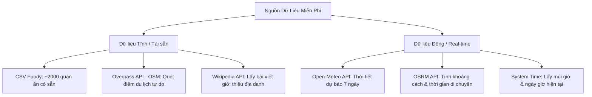
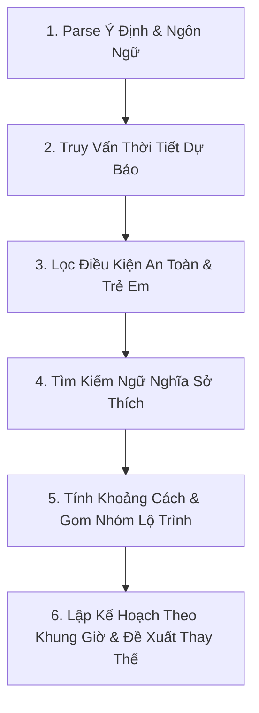

# 📝 Nghiên Cứu Giải Pháp Thu Thập & Lưu Trữ Dữ Liệu Lập Lịch Trình (Itinerary Planning) — Đà Nẵng

Tài liệu này nghiên cứu và đề xuất giải pháp thu thập dữ liệu **hoàn toàn miễn phí (100% Free)**, thiết kế cấu trúc lưu trữ cơ sở dữ liệu chi tiết, các trường thông tin thời gian thực (real-time) và logic lập lịch trình thông minh để Weatherise v2 đóng vai trò như một **chuyên gia tư vấn du lịch thực thụ**.

---

## 1. Bản Đồ Dữ Liệu Đầu Vào & Công Cụ Thu Thập Miễn Phí (100% Free Stack)

Để hệ thống hoạt động không tốn chi phí vận hành API, chúng ta sử dụng kiến trúc dữ liệu sau:



### 1.1. Cách thu thập điểm tham quan du lịch (Sightseeing & POIs) - Free
Chúng ta không sử dụng Google Places API vì phí cao. Thay vào đó sử dụng:
* **Overpass API (OpenStreetMap):** 
  * Gửi yêu cầu HTTP GET miễn phí để lấy tọa độ và thông tin các điểm tham quan tại Đà Nẵng với bounding box `[15.90, 107.90, 16.20, 108.30]`.
  * **Query mẫu (Overpass QL):**
    ```xml
    [out:json];
    node["tourism"~"attraction|museum|viewpoint|gallery|theme_park"](15.90,107.90,16.20,108.30);
    out body;
    ```
* **Wikipedia/Wikidata API:** 
  * Gọi API lấy phần tóm tắt (extract) của địa danh theo tọa độ để hiển thị thông tin giới thiệu hấp dẫn cho du khách.

### 1.2. Cách tính khoảng cách di chuyển giữa các điểm - Free
* **OSRM API (Open Source Routing Machine):**
  * Sử dụng API demo công cộng `http://router.project-osrm.org/table/v1/driving/...` để tính toán ma trận thời gian và khoảng cách di chuyển giữa danh sách các địa điểm trong lịch trình (không cần dùng Google Distance Matrix API có phí).

---

## 2. Các Dữ Liệu Cần Xử Lý Thời Gian Thực (Real-Time Data)

Để lên lịch trình thực tế, hệ thống không chỉ đọc dữ liệu tĩnh từ database mà phải gọi trực tiếp các API động tại thời điểm người dùng chat:

1. **Dự báo thời tiết chi tiết theo khung giờ (Open-Meteo API):** 
   * Lấy dữ liệu lượng mưa, tốc độ gió, nhiệt độ, chỉ số UV theo từng giờ tại các ngày nằm trong lịch trình dự kiến.
2. **Thời gian hiện tại và múi giờ (System Clock):** 
   * Xác định ngày trong tuần, giờ hiện tại của Việt Nam (ICT, UTC+7) để xử lý các câu lệnh dạng *"hôm nay đi đâu"*, *"sáng mai ăn gì"*, *"cuối tuần này có mưa không"*.
3. **Thời gian di chuyển thực tế (OSRM Route API):** 
   * Tính toán thời gian đi lại giữa khách sạn $\rightarrow$ điểm A $\rightarrow$ điểm B $\rightarrow$ nhà hàng $\rightarrow$ khách sạn dựa trên tọa độ chính xác nhằm tránh xếp các địa điểm quá xa nhau vào cùng một buổi.

---

## 3. Thiết Kế Cơ Sở Dữ Liệu Tích Hợp (Unified Database Schema)

Để tạo ra một chuyên gia tư vấn du lịch thông minh, bảng dữ liệu lưu trữ cần có các trường thuộc tính sâu về **Đặc trưng không gian (Vibe/Vibe-tags)**, **Ngưỡng nhạy cảm thời tiết**, và **Thời gian sinh hoạt tối ưu**.

### 3.1. Bảng lưu trữ địa điểm tích hợp (`locations`) - PostgreSQL
Bảng này gộp chung cả Điểm tham quan (Sightseeing) và Nhà hàng (Restaurants) để đồng bộ hóa các truy vấn không gian.

```sql
CREATE EXTENSION IF NOT EXISTS postgis;

CREATE TABLE locations (
    id VARCHAR(50) PRIMARY KEY, -- Ví dụ: danang_my_khe_beach, foody_934233
    source VARCHAR(20) NOT NULL, -- 'foody_csv', 'osm_attraction', 'manual_seed'
    name_vi VARCHAR(150) NOT NULL,
    name_en VARCHAR(150),
    category VARCHAR(50) NOT NULL, -- 'attraction', 'restaurant', 'cafe', 'entertainment'
    sub_category VARCHAR(50),      -- 'seafood', 'beach', 'museum', 'local_food', 'park'
    address TEXT,
    district VARCHAR(50),          -- 'Hai Chau', 'Son Tra', 'Ngu Hanh Son', etc.
    latitude DOUBLE PRECISION NOT NULL,
    longitude DOUBLE PRECISION NOT NULL,
    coordinate GEOGRAPHY(Point, 4326), -- PostGIS Spatial type để tính khoảng cách
    
    -- Các trường phục vụ nghiệp vụ tư vấn
    avg_rating DECIMAL(3, 2) DEFAULT 0.0,
    price_tier VARCHAR(10) DEFAULT 'medium', -- 'budget', 'medium', 'premium'
    avg_duration_minutes INT DEFAULT 60,     -- Thời gian tham quan/ăn uống trung bình tại đây
    opening_hours JSONB,                    -- Giờ mở cửa: {"open": "08:00", "close": "22:00"}
    best_visit_times VARCHAR(20)[] DEFAULT '{}', -- Khung giờ đẹp nhất: {'morning', 'afternoon', 'evening', 'sunset'}
    vibe_tags VARCHAR(50)[] DEFAULT '{}',   -- ['chill', 'romantic', 'family_friendly', 'street_food', 'photo_spot']
    description TEXT,                       -- Đoạn thuyết minh ngắn phục vụ RAG
    
    -- Lớp Trí tuệ Thời tiết (Weatherise Core Intelligence)
    is_indoor BOOLEAN DEFAULT false,       -- Trong nhà hay ngoài trời
    rain_sensitive BOOLEAN DEFAULT true,   -- Có bị ảnh hưởng lớn nếu trời mưa không?
    uv_sensitive BOOLEAN DEFAULT false,    -- Có bị ảnh hưởng bởi nắng gắt/UV trưa không (ví dụ: bãi biển)?
    bad_weather_rules JSONB DEFAULT '{}',  -- Ngưỡng thời tiết xấu: {"max_wind_kmh": 30, "max_precipitation_mm": 1.5}
    safe_alternatives VARCHAR(50)[] DEFAULT '{}' -- Danh sách ID địa điểm trong nhà thay thế gần đó
);

-- Tạo Index không gian để tính toán khoảng cách siêu tốc
CREATE INDEX idx_locations_coordinate ON locations USING GIST (coordinate);
```

### 3.2. Payload lưu trữ trong Qdrant Vector Collection (`danang_locations`)
Mỗi địa điểm trong PostgreSQL sẽ được đồng bộ sang Qdrant dưới dạng Vector Embedding (được nhúng từ chuỗi thông tin kết hợp: Tên + Vibe tags + Description + Cuisines).

```json
{
  "id": "foody_934233",
  "vector": [0.012, -0.045, 0.098, "..."], // 1024-dimension
  "payload": {
    "name_vi": "Bông Food & Drink",
    "category": "restaurant",
    "sub_category": "cafe",
    "district": "Hai Chau",
    "is_indoor": true,
    "vibe_tags": ["cafe", "teen", "checkin", "dessert"],
    "price_tier": "budget"
  }
}
```

---

## 4. Quy Trình 6 Bước Của Chuyên Gia Tư Vấn Du Lịch AI (Advisor Logic)

Khi nhận được yêu cầu từ du khách: *"Tụi mình đi du lịch 2 ngày cuối tuần này, muốn ăn hải sản ngon và đi ngắm cảnh chụp hình, có em bé đi cùng nha"*:



### Bước 1: Phân tích Ý định & Ngôn ngữ (Parsing)
* **Parser Agent** xác định:
  * Khoảng thời gian: *Cuối tuần này* $\rightarrow$ Dịch sang ngày cụ thể bằng **MCP Time Tool** (ví dụ: Thứ Bảy 13/06 và Chủ Nhật 14/06).
  * Sở thích: *ăn hải sản*, *chụp hình*.
  * Ràng buộc người dùng: *có em bé đi cùng* $\rightarrow$ Cần ưu tiên các địa điểm an toàn, dễ đi lại (`vibe_tags` chứa `family_friendly`, loại bỏ các điểm leo trèo dốc cao).

### Bước 2: Truy vấn Thời tiết Dự báo (Weather Fetching)
* Gọi API **Open-Meteo** lấy dự báo thời tiết theo giờ của 2 ngày cuối tuần tại Đà Nẵng.
* Đánh giá rủi ro theo giờ: Xác định khung giờ nào mưa, giờ nào nắng gắt (UV cao), giờ nào thời tiết mát mẻ.

### Bước 3: Lọc Điều kiện An toàn (Constraint Filtering)
* Nếu ngày thứ Bảy có mưa lúc 15:00 - 17:00 $\rightarrow$ Đánh nhãn khung giờ này chỉ được chọn điểm có `is_indoor = true`.
* Lọc bỏ các điểm du lịch có tính mạo hiểm cao (dốc núi Sơn Trà) vì ràng buộc *"có em bé đi cùng"*.

### Bước 4: Tìm kiếm Sở thích & Ăn uống (Preference Matching)
* Nhúng câu hỏi của người dùng và thực hiện tìm kiếm trên **Qdrant**:
  * Tìm kiếm 1: Quán ăn hải sản ngon, view rộng rãi (`tags = ["seafood"]`). Kết quả trả về danh sách nhà hàng từ dữ liệu Foody.
  * Tìm kiếm 2: Điểm ngắm cảnh chụp hình phù hợp gia đình (`tags = ["photo_spot", "family_friendly"]`). Kết quả trả về các địa danh như Cầu Rồng, Sun Wheel.

### Bước 5: Gom nhóm Lộ trình theo Không gian (Spatial Routing)
* Sử dụng **PostGIS** để tính toán khoảng cách:
  * Nhóm các địa điểm có khoảng cách gần nhau vào cùng một ngày (ví dụ: Bãi biển Mỹ Khê và các nhà hàng Hải sản quận Sơn Trà sẽ đi cùng ngày; Chùa Linh Ứng và Bán đảo Sơn Trà đi cùng ngày).
* Gọi **OSRM API** lấy ma trận thời gian di chuyển để sắp xếp thứ tự đi: Điểm A $\rightarrow$ Điểm B $\rightarrow$ Quán ăn tối sao cho tổng thời gian đi xe là ngắn nhất.

### Bước 6: Lập Kế hoạch Chi tiết & Đề xuất Dự phòng
* Sắp xếp các điểm vào khung thời gian đẹp nhất của chúng (`best_visit_times`): Ngắm Cầu Rồng vào buổi tối; đi tắm biển Mỹ Khê lúc sáng sớm hoặc chiều mát.
* **Ghi chú Dự phòng Thời tiết (Weather Fallback Advisory):** 
  * *"Chiều thứ Bảy dự báo có mưa rào nhẹ lúc 16:00. Nếu lúc đó trời mưa, bạn hãy hoãn đi dạo bãi biển Mỹ Khê và di chuyển sang **Bảo tàng Chăm** hoặc vào quán **Bông Food & Drink** gần đó để nghỉ ngơi nhé!"* (Dựa trên thông số `safe_alternatives`).
