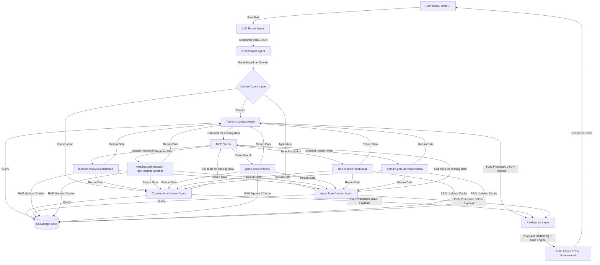

# 🌦️ Kiến Trúc Hệ Thống & Tech Stack - Weatherise v2

Tài liệu này mô tả chi tiết kiến trúc hệ thống (System Architecture) và các công nghệ đang được sử dụng (Tech Stack) của dự án **Weatherise** phiên bản v2.

---

## 1. Tổng Quan Hệ Thống (System Overview)
**Weatherise** là một hệ thống Multi-Agent đa miền (Domain-Aware Multi-Agent System), tích hợp dữ liệu thời tiết thời gian thực và các thuật toán đánh giá rủi ro để đưa ra các gợi ý và kế hoạch hành động tối ưu cho người dùng. 

Hệ thống được thiết kế theo hướng module hóa cao, tách biệt rõ ràng giữa việc phân tích cú pháp (parsing), định tuyến (routing), làm giàu ngữ cảnh (context enrichment) qua MCP (Model Context Protocol), và đưa ra quyết định thông minh (intelligence layer).

---

## 2. Kiến Trúc Hệ Thống (System Architecture)

### Sơ đồ luồng dữ liệu (Mermaid Diagram)
Dưới đây là sơ đồ luồng dữ liệu từ khi nhận yêu cầu của người dùng cho đến khi trả về kết quả cuối cùng:



### Quy trình chạy thực tế (Runtime Flow)
1. **User Input:** Người dùng nhập yêu cầu bằng ngôn ngữ tự nhiên (ví dụ: *"Lên kế hoạch du lịch Đà Nẵng 3 ngày tuần tới, tránh mưa lớn"*).
2. **LLM Parser:** Sử dụng mô hình **Nemotron-3 Super 120B** (qua NVIDIA NIM) để chuyển câu lệnh thô thành JSON cấu trúc ban đầu gồm: `domain`, `intent`, `location`, `time_range`, `user_constraints`. Trường `involved_context` được khởi tạo trống `[]`.
3. **Orchestrator Agent:** Nhận JSON cấu trúc từ Parser và định tuyến đến Context Agent phù hợp dựa vào `domain` (tourism, construction, agriculture).
4. **Context Agent Layer:** 
   - Điền danh sách ngữ cảnh cần thiết vào `involved_context`.
   - Tìm kiếm ngữ cảnh ổn định trong **Knowledge Base**.
   - Nếu thiếu thông tin, Context Agent sẽ gọi **MCP Server** để lấy thông tin động bên ngoài.
5. **MCP Server:** Thực thi các API bên ngoài như lấy tọa độ địa lý, dự báo thời tiết từ **Open-Meteo/OpenWeatherMap**, giờ mở cửa của các địa điểm du lịch, v.v.
6. **RAG Update:** Lưu trữ các thông tin tái sử dụng được trở lại **Knowledge Base** (Vector DB/PostgreSQL) thông qua luồng RAG.
7. **Intelligence Layer:** 
   - Nhận payload JSON đã được làm giàu đầy đủ ngữ cảnh (Fully Processed JSON).
   - Đánh giá rủi ro thời tiết bằng bộ quy tắc cứng (Rule-based Prediction Engine) để đảm bảo độ tin cậy.
   - Kết hợp kết quả đánh giá rủi ro và ngữ cảnh để gọi **NVIDIA NIM LLM** lập luận chuyên sâu và sinh ra lời khuyên bằng ngôn ngữ tự nhiên thân thiện cho người dùng.
8. **Response:** Kết quả cuối cùng được trả về cho Web Frontend để hiển thị cho người dùng.

---

## 3. Công Nghệ Sử Dụng (Tech Stack)

### 🖥️ Frontend (Ứng dụng Web)
* **Next.js 14 (App Router):** Framework chính cho ứng dụng web dưới dạng PWA (Progressive Web App).
* **React 18:** Thư viện giao diện người dùng.
* **TailwindCSS:** Thư viện CSS để thiết kế giao diện responsive hiện đại.
* **Lucide React:** Bộ icon hiển thị sinh động.
* *(Lưu ý: Gradio được dùng làm giao diện thử nghiệm nhanh MVP ở v1).*

### ⚡ Backend API
* **FastAPI (Python):** Framework hiệu năng cao để phát triển API Gateway, xử lý WebSocket cho streaming logs thời gian thực.
* **Uvicorn:** ASGI Web Server để vận hành FastAPI.
* **SQLAlchemy & Asyncpg:** Thư viện ORM và driver kết nối bất đồng bộ tới PostgreSQL.
* **Pydantic v2:** Quản lý và kiểm chuẩn kiểu dữ liệu (data validation/schemas).
* **APScheduler:** Bộ lập lịch chạy ngầm để cập nhật dữ liệu thời tiết định kỳ (Weather Watcher).

### 🤖 AI / Agent Layer & Models
* **LangGraph:** Sử dụng để điều khiển luồng công việc (workflow state machine) của các Agent.
* **LangChain Core:** Hỗ trợ kết nối các Agent Tools và MCP clients.
* **NVIDIA NIM (NVIDIA Inference Microservice):**
  * **LLM Engine:** `nvidia/nemotron-3-super-120b-a12b` dùng cho phân tích yêu cầu (Parser) và suy luận lời khuyên (Intelligence).
  * **Embedding Engine:** `nvidia/nv-embedqa-e5-v5` dùng để nhúng vector phục vụ cho RAG.
* **NVIDIA NeMo Guardrails (Dự kiến):** Đảm bảo an toàn và tính nhất quán cho phản hồi của mô hình.

### 🗄️ Database & Storage
* **Qdrant (Vector Database):** Cơ sở dữ liệu Vector dùng cho việc lưu trữ và truy vấn ngữ cảnh (RAG Knowledge Base).
* **PostgreSQL 16:** Cơ sở dữ liệu quan hệ dùng để lưu trữ dữ liệu cấu trúc (người dùng, cấu hình miền, logs hệ thống).
* **Redis 7 (Alpine):** Bộ nhớ đệm (Cache) tốc độ cao cho kết quả thời tiết, phiên làm việc (Session) và hỗ trợ quản lý trạng thái WebSocket.

### 🛠️ Infrastructure (Hạ tầng triển khai)
* **Docker & Docker Compose:** Đóng gói và chạy các dịch vụ cô lập trên server.
* **Nginx:** Reverse Proxy tiếp nhận các request từ cổng công khai (`8080`), điều phối luồng:
  - `/` -> Frontend Web (`web:3000`)
  - `/api` -> FastAPI Backend (`api:8000`)
  - `/ws` -> WebSocket API (`api:8000/ws`)
* **NVIDIA H200 Server / Host Infrastructure:** Toàn bộ hệ thống (giao diện, backend, database, mô hình NIM) được lưu trữ và chạy trực tiếp trên hạ tầng server NVIDIA của cuộc thi. Các container NIM LLM/Embed được chạy riêng biệt tận dụng GPU chuyên dụng.

---

## 4. Phân Định Trách Nhiệm Dữ Liệu (Data Ownership)

| Thành phần (Component) | Quyền sở hữu / Nhiệm vụ (Owns) | Phạm vi không sở hữu (Does Not Own) |
| :--- | :--- | :--- |
| **User Input** | Ghi nhận yêu cầu ngôn ngữ tự nhiên từ người dùng. | Không phân tích cú pháp, không định tuyến và lập luận. |
| **LLM Parser** | Chuyển đổi ngôn ngữ tự nhiên thành JSON cấu trúc ban đầu. | Không điền chi tiết ngữ cảnh, không gọi MCP, không trả lời trực tiếp. |
| **Orchestrator Agent** | Định tuyến yêu cầu đến Context Agent phù hợp. | Không trực tiếp truy vấn database hay dự báo thời tiết. |
| **Context Agent Layer** | Điền ngữ cảnh yêu cầu, kiểm tra KB và kích hoạt MCP để lấy thông tin thiếu. | Không đưa ra quyết định đánh giá rủi ro hay sinh lời khuyên cuối cùng. |
| **Knowledge Base** | Lưu trữ tri thức miền ổn định (tọa độ, địa điểm du lịch, luật thời tiết). | Không trực tiếp gọi các API thời gian thực bên ngoài. |
| **MCP Server / Routes** | Thực hiện gọi API bên ngoài một cách tập trung, an toàn. | Không điều phối luồng tổng thể hay lập luận logic. |
| **RAG Update Pipeline** | Chuẩn hóa, nhúng vector và cập nhật tri thức mới vào Vector DB. | Không tự quyết định độ rủi ro thời tiết. |
| **Intelligence Layer** | Chạy công cụ chấm điểm rủi ro thời tiết cứng và dùng NIM LLM tổng hợp lời khuyên. | Không định tuyến hay làm nhiệm vụ parsing ban đầu. |

---

## 5. Cấu Hiện Triển Khai Thực Tế (Docker Services)

Hệ thống được vận hành đồng bộ qua file cấu hình `docker-compose.yml` với các cổng dịch vụ nội bộ:

```yaml
services:
  nginx:       # Port ngoài: 8080 -> Port trong: 80 (Reverse proxy điều hướng)
  web:         # Port nội bộ: 3000 (Next.js frontend)
  api:         # Port nội bộ: 8000 (FastAPI backend)
  mcp-server:  # Port nội bộ: 9000 (MCP Server điều phối API bên ngoài)
  vector-db:   # Port nội bộ: 6333 (Qdrant Vector DB)
  redis:       # Port nội bộ: 6379 (Redis Cache)
  postgres:    # Port nội bộ: 5432 (PostgreSQL Database)
```
*Lưu ý: Các mô hình NIM được host sẵn trên server ở cổng `8001` (NIM LLM) và `8002` (NIM Embed).*

---

## 🔗 Tài Liệu Liên Quan
* [Luồng Dữ Liệu & Nguồn Dữ Liệu (data_flow.md)](file:///raid/team/weatherise/workspaces/quanton/WeatherRise-2026/docs/data_flow.md)
* [Cấu Trúc Payload Lớp Trí Tuệ (intelligence_payload.md)](file:///raid/team/weatherise/workspaces/quanton/WeatherRise-2026/docs/intelligence_payload.md)
* [Nghiên Cứu Giải Pháp Lập Lịch Trình (research_itinerary_planning.md)](file:///raid/team/weatherise/workspaces/quanton/WeatherRise-2026/docs/research_itinerary_planning.md)


