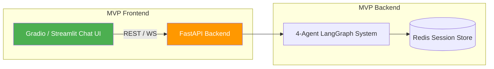
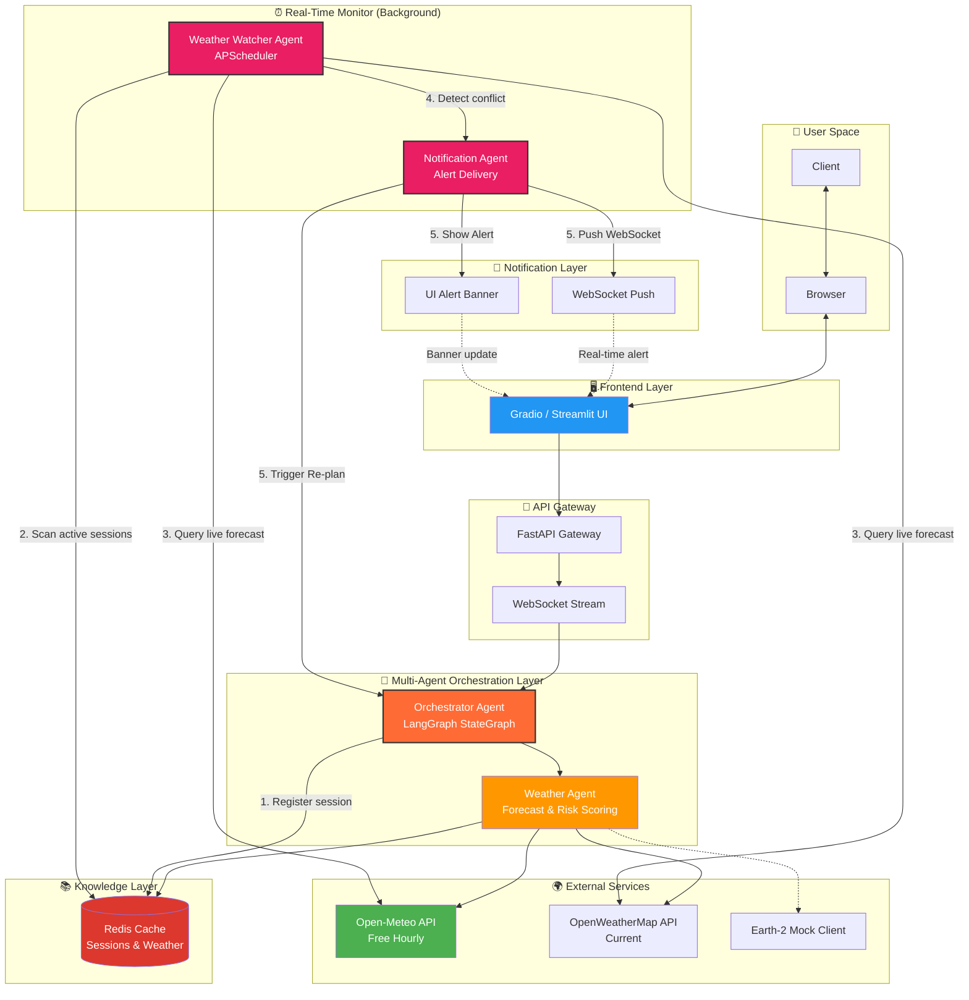
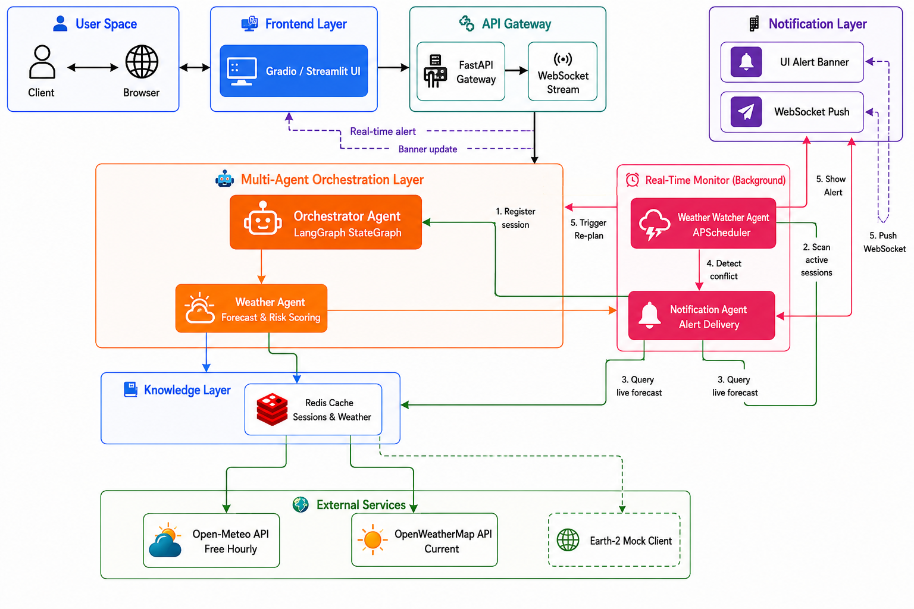
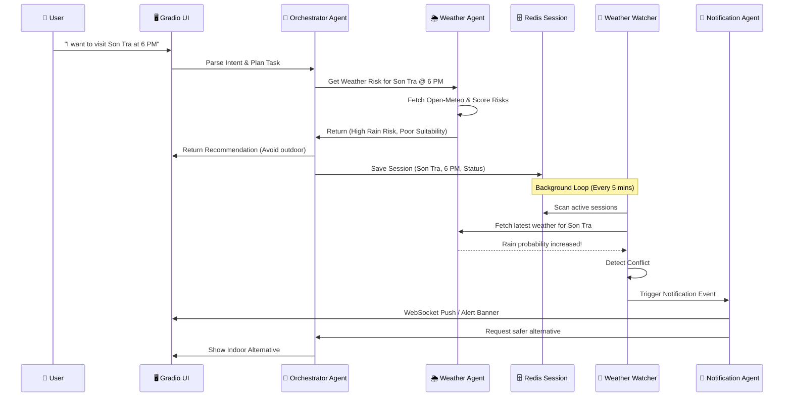

# 🌦️ Weatherise MVP — Simplified Multi-Agent System

> **Team:** Weatherise (4 members) | **Hackathon Duration:** 5 days | **MVP Focus:** Core Weather-Risk Intelligence & Proactive Alerts 

---

## 📋 Table of Contents

1. [Project Overview (MVP Scope)](#-project-overview-mvp-scope)
2. [Why This Matters Now](#-why-this-matters-now)
3. [Platform Strategy](#-platform-strategy)
4. [System Architecture](#-system-architecture)
5. [Agent Design](#-agent-design)
6. [Data & API Sources](#-data--api-sources)
7. [Tech Stack](#-tech-stack)
8. [User Input / Output](#-user-input--output)
9. [UI / Frontend Design](#-ui--frontend-design)
10. [Deployment](#-deployment)
11. [Monitoring & Observability](#-monitoring--observability)

---

## 🎯 Project Overview (MVP Scope)

**Weatherise MVP** focuses exclusively on the core innovation of the platform: **translating raw weather data into Vietnam-specific weather risks and proactively alerting users when conditions change.** 

The MVP operates as a **4-agent system** that proves the highest-value concept:
```
User Query → Orchestrator Agent → Weather Agent → Risk Analysis & Recommendation
                                        ↕ (real-time loop via Redis)
                          Weather Watcher Agent → Notification Agent → Real-Time Alert
```

### MVP Focus Areas

| Area | Description |
|------|-------------|
| 🌤️ **Weather** | Open-Meteo (hourly) + OpenWeatherMap (current). Mock Earth-2 pipeline for demonstration. |
| ⚡ **Risk Scoring** | Rule-based engine translating Rain, Heat, and Wind into actionable insights. |
| 🔔 **Real-Time Alerts** | Background monitoring detecting weather conflicts and pushing WebSocket/UI banner alerts. |
| 🔄 **Architecture** | Built on LangGraph and FastAPI to provide a robust, stateful agent workflow. |

---

## 🔥 Why This Matters Now

Even in its simplified MVP state, Weatherise solves a critical problem: **Tourists lack proactive weather guidance.**
While standard apps show "30% rain", they do not say "It is unsafe to visit Son Tra Peninsula at 4 PM due to high wind risk." The MVP proves we can bridge this gap automatically.

---

## 📱 Platform Strategy

### Recommended: **Gradio / Streamlit UI (Fast Demo)**

For the MVP, we use a Python-based UI (Gradio or Streamlit) that connects to our robust FastAPI backend. This allows rapid iteration while ensuring the backend logic is completely decoupled and production-ready.



---

## 🏗️ System Architecture

### High-Level MVP Architecture



### Request Flow (Sequence Diagram)



---

## 🤖 Agent Design

We implement 4 highly focused agents for the MVP:

### 1. Orchestrator Agent (LangGraph)
- **Role:** The brain of the system. Manages the workflow state.
- **Responsibilities:** Extracts location/time from user input, invokes the Weather Agent, formats the final output, and saves active sessions to Redis.

### 2. Weather Agent
- **Role:** Weather data fetcher and risk interpreter.
- **Responsibilities:** Fetches data from Open-Meteo/OWM. Applies a Rule-Based logic engine (e.g., Rain > 60% = High Risk). Outputs a standardized `WeatheriseRiskSchema`.

### 3. Weather Watcher Agent (Background)
- **Role:** Proactive monitoring daemon.
- **Responsibilities:** Uses `APScheduler` to iterate over active user sessions in Redis. Re-fetches weather data periodically, compares risk against baseline, and triggers alerts if weather degrades.

### 4. Notification Agent
- **Role:** Alert formatting and delivery.
- **Responsibilities:** Takes conflict data from the Watcher, formats it into readable text, and pushes the alert to the UI via WebSocket.

---

## 🌍 Data & API Sources

| Service | Purpose | Type |
|---------|---------|------|
| **Open-Meteo API** | Free, no-key hourly forecasts (16-day). | Primary Data Source |
| **OpenWeatherMap** | Current conditions fallback. | Secondary Data Source |
| **Earth-2 Mock** | Simulated NVIDIA Earth-2 data endpoints. | Demo Integration |

---

## 🛠️ Tech Stack

| Category | MVP Technology |
|----------|----------------|
| **Backend Framework** | FastAPI, Uvicorn |
| **Agent Orchestration** | LangGraph, LangChain |
| **Frontend UI** | Gradio / Streamlit |
| **State & Caching** | Redis |
| **LLM / Parsing** | OpenAI API (fallback) / Mock |
| **Background Jobs** | APScheduler |

---

## 📥 User Input / Output

### Input Mechanisms:
- Natural language text query via the Chat Interface.
- Manual "Trigger Weather Alert" developer button for demonstration purposes.

### Output Mechanisms:
1. **Chat Response:** Clear weather summary + risk level + structured recommendation.
2. **Real-time Alert Banner:** A dynamic warning banner that pops up natively in the UI via WebSocket when the background agent detects a conflict.

---

## 🎨 UI / Frontend Design

### Gradio Interface Layout
- **Left Panel:** Main chat interface for user interaction and itinerary requests.
- **Right Panel (Debug & Status):**
  - Displays the current active sessions stored in Redis.
  - Controls to manually "Simulate Weather Degradation" for judges.
- **Top Banner:** Hidden by default. Flashes with warning colors when the Notification Agent pushes an alert.

---

## 🚀 Deployment

### Local Docker Compose
The MVP is designed to run seamlessly on a local machine or a lightweight cloud VM using Docker Compose.

```yaml
services:
  redis:
    image: redis:alpine
    ports: ["6379:6379"]
  backend:
    build: .
    ports: ["8000:8000"]
    depends_on: [redis]
```
*(The UI application can run alongside the backend or as a separate container).*

---

## 📊 Monitoring & Observability

- **Application Logs:** Standard Python `logging` to stdout.
- **Agent Tracing:** LangGraph standard debug output to terminal to trace node execution.
- **Background Jobs:** Console output indicating when APScheduler scans Redis sessions and detects changes.

---


