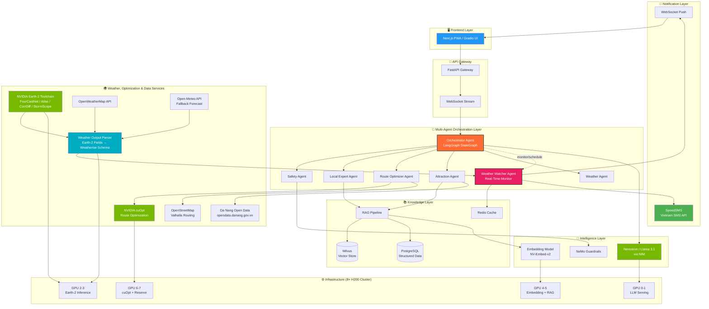

```mermaid
flowchart TB

    %% =======================
    %% FRONT / API / NOTIFY
    %% =======================
    subgraph NOTI["📱 Notification Layer"]
        WSOCK["WebSocket Push"]
        SMS["SpeedSMS<br/>Vietnam SMS API"]
    end

    subgraph FRONT["🖥️ Frontend Layer"]
        UI["Next.js PWA / Gradio UI"]
    end

    subgraph API["🔌 API Gateway"]
        GW["FastAPI Gateway"]
        WS["WebSocket Stream"]
    end

    %% =======================
    %% ORCHESTRATION
    %% =======================
    subgraph AGENT["🤖 Multi-Agent Orchestration Layer"]
        ORCH["Orchestrator Agent<br/>LangGraph StateGraph"]
        SA["Safety Agent"]
        LA["Local Expert Agent"]
        RA["Route Optimizer Agent"]
        AA["Attraction Agent"]
        WA["Weather Agent"]
        WW["Weather Watcher Agent<br/>Real-Time Monitor"]
    end

    %% =======================
    %% CORE AI / KNOWLEDGE
    %% =======================
    subgraph INTEL["🧠 Intelligence Layer"]
        LLM["Nemotron / Llama 3.1<br/>via NIM"]
        GR["NeMo Guardrails"]
        EMB["Embedding Model<br/>NV-Embed-v2"]
    end

    subgraph KNOW["📚 Knowledge Layer"]
        RAG["RAG Pipeline"]
        RD["Redis Cache"]
        PG[("PostgreSQL<br/>Structured Data")]
        VS[("Milvus<br/>Vector Store")]
    end

    %% =======================
    %% WEATHER / OPTIMIZATION / DATA SERVICES
    %% =======================
    subgraph EXT["🌍 Weather, Optimization & Data Services"]
        E2["NVIDIA Earth-2 Toolchain<br/>FourCastNet / Atlas / CorrDiff / StormScope"]
        PARSER["Weather Output Parser<br/>Earth-2 Fields → Weatherise Schema"]
        OWM["OpenWeatherMap API"]
        OM["Open-Meteo API<br/>Fallback Forecast"]
        CUOPT["NVIDIA cuOpt<br/>Route Optimization"]
        OSM["OpenStreetMap<br/>Valhalla Routing"]
        DNOG["Da Nang Open Data<br/>opendata.danang.gov.vn"]
    end

    %% =======================
    %% INFRA
    %% =======================
    subgraph INFRA["⚙️ Infrastructure (8× H200 Cluster)"]
        GPU1["GPU 0-1<br/>LLM Serving"]
        GPU2["GPU 2-3<br/>Earth-2 Inference"]
        GPU3["GPU 4-5<br/>Embedding + RAG"]
        GPU4["GPU 6-7<br/>cuOpt + Reserve"]
    end

    %% =======================
    %% MAIN FLOW
    %% =======================
    UI --> GW
    GW --> WS
    WS --> ORCH

    ORCH --> SA
    ORCH --> LA
    ORCH --> RA
    ORCH --> AA
    ORCH --> WA
    ORCH -. monitor/schedule .-> WW

    SA --> GR
    LA --> RAG
    AA --> RAG
    AA --> DNOG
    RA --> CUOPT
    RA --> OSM

    E2 --> PARSER
    OWM --> PARSER
    OM --> PARSER
    PARSER --> WW

    WW --> RD
    WW --> WSOCK
    WW --> SMS
    WSOCK --> UI

    RAG --> VS
    RAG --> PG
    RAG --> EMB

    ORCH --> LLM
    LLM --> GPU1
    E2 --> GPU2
    PARSER --> GPU2
    EMB --> GPU3
    CUOPT --> GPU4

    %% =======================
    %% STYLES
    %% =======================
    style ORCH fill:#FF6B35,color:#fff,stroke:#333,stroke-width:2px
    style WW fill:#E91E63,color:#fff,stroke:#333,stroke-width:2px
    style LLM fill:#76B900,color:#fff
    style E2 fill:#76B900,color:#fff
    style CUOPT fill:#76B900,color:#fff
    style UI fill:#2196F3,color:#fff
    style SMS fill:#4CAF50,color:#fff
    style PARSER fill:#00ACC1,color:#fff
```